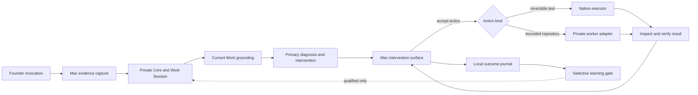
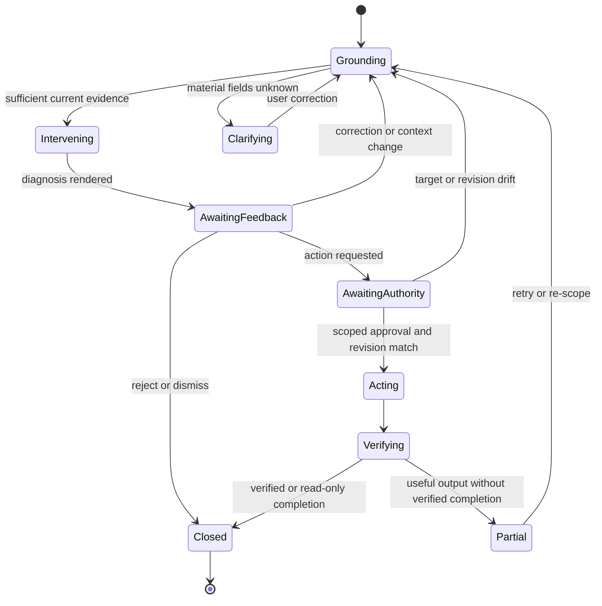
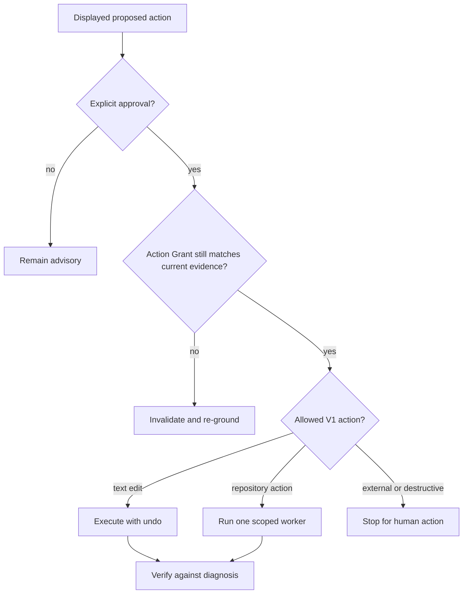

# Flyd Work Intelligence Loop - Plan

## Goal Capsule

Implement the founder V1 of Flyd as a Mac-native work-intelligence layer. Flyd must understand the foreground work, identify the highest-leverage issue, improve the work, perform an approved bounded action, verify the result, and retain only useful learning.

Authority order:

1. The current foreground artifact, repository state, and explicit user correction.
2. The Product Contract in this plan and `docs/product/flyd-work-intelligence-prd.md`.
3. The settled strategy in `STRATEGY.md`.
4. Existing implementation patterns and historical memory.

Execution profile:

- Extend the installed Mac overlay and its private TypeScript Core.
- Preserve deterministic dictation as a separate path.
- Support critique in design, writing, strategy, code, and research.
- Limit V1 action to reversible text operations and one bounded repository action.
- Validate the product through the seven-day founder trial before expanding architecture.

Stop implementation and surface a blocker if:

- current work cannot be distinguished from historical memory without inventing evidence;
- an action requires a gateway, messaging channel, general agent runtime, background autonomy, or provider marketplace;
- an action requires credentials, permission grants, publishing, deployment, purchasing, or destructive external effects;
- the foreground project or artifact changes after approval and cannot be safely re-grounded;
- the repository action cannot return a verified artifact or diff to the originating Mac interaction.

The implementation owner carries the work through installed-app verification. Unit tests or CLI output alone do not complete the plan.

## Product Contract

### Summary

Flyd turns a deliberate Mac invocation into a closed work loop: Ground, Diagnose, Intervene, Act, Verify, and Learn. It uses current screen, document, repository, and conversation evidence to understand what the user is doing. It returns one useful intervention quickly, performs only the approved next action, verifies the real result, and preserves continuity without becoming a general-purpose agent platform.

### Problem Frame

Flyd already captures the screen and accessibility context, answers through a local intelligence core, performs reversible text operations, retrieves memory, and contains verified worker primitives. These pieces do not yet produce the promised outcome. The resolver is route-first, current-project reasoning is anchored to Flyd's own process directory, text continuity is incomplete, the overlay cannot point to the diagnosed region, action results are not evaluated against the original issue, and current metrics do not show whether the user's work improved.

### Actors

- A1. Founder — invokes Flyd while doing real work and grants authority for a concrete next action.
- A2. Flyd Mac app — captures current evidence, renders the intervention, executes native actions, and protects the active target.
- A3. Flyd Core — grounds the work, diagnoses the primary issue, proposes an intervention, coordinates verification, and selects learning candidates.
- A4. Bounded repository worker — performs one approved repository action inside the granted root and returns evidence to the originating interaction.

### Requirements

#### Current work and continuity

- R1. Flyd must construct Current Work from the foreground project, objective, artifact, stage, constraints, open loops, next action, evidence, and uncertainty.
- R2. Live foreground evidence and explicit user correction must outrank historical memory for every current-state claim.
- R3. Flyd must mark unsupported Current Work fields as unknown or hypotheses instead of silently filling them from memory.
- R4. Text and conversational voice invocations must share a bounded Work Session that retains the current artifact, diagnosis, approved action, verification, closeout, and follow-up context.
- R5. A material foreground, artifact-revision, or project-root change must invalidate action authority and require re-grounding.

#### Diagnosis and intervention

- R6. A substantial invocation must evaluate the work through Ground, Diagnose, and Intervene before selecting a manifestation or action.
- R7. Flyd must return one primary causal diagnosis and a stronger alternative or next move, not a list of generic observations.
- R8. Flyd must apply explicit evaluation standards for design, writing, strategy, code, and research while preserving one common intervention contract.
- R9. The first useful response must appear in the Mac experience and remain available for follow-up, correction, acceptance, rejection, or action approval.
- R10. When visual evidence supports it, Flyd must place or point the intervention relative to the relevant screen region rather than render every card at a generic center position.

#### Action and verification

- R11. Flyd must treat an accepted intervention as authority for one concrete, bounded action only.
- R12. Reversible text replacement or insertion must remain the primary action path and retain target verification, stale-revision rejection, confirmation, and undo.
- R13. V1 must support one bounded file or repository action using the approved root, diagnosis-derived instruction, finish condition, minimum relevant context, and existing verified worker primitives.
- R14. Flyd must reject scope expansion, writes outside the approved root, unverifiable completion, and worker activity presented as completion.
- R15. Flyd must verify the changed field, file, diff, or repository state against the original diagnosis before reporting success.
- R16. The verified result must return to the same Mac Work Session with what changed, where it changed, how it was checked, what remains unresolved, and the recommended next action.

#### Shell execution (V1 scope expansion — 2026-08-05)

- R-SH1. Interventions may propose shell commands when they are the right fix; the Ground-Diagnose-Intervene pipeline must freely propose shell commands rather than suppress them into instruction text.
- R-SH2. Every shell command must be displayed with its full text, working directory, explanation, and a destructive/non-destructive label before execution.
- R-SH3. Commands must be rejected if they are interactive (require stdin), connect to remote hosts, match deny-list patterns (rm -rf /, dd, mkfs, etc.), or target paths outside the resolved project root.
- R-SH4. Core executes approved commands via child_process.spawn and streams stdout/stderr back to the Mac adapter for visible progress tracking.
- R-SH5. Each command has a timeout (30s default, 120s max), cancellation support, and a 50KB output buffer cap.
- R-SH6. After execution, show exit code, stdout/stderr summary, and whether the command succeeded; multi-command executions stop on first non-zero exit.
- R-SH7. The existing consequence classifier must stop suppressing consequential intents into instruction text for commands that are reversible or have explicit user approval.
- R-SH8. Command approval and execution results are recorded in the founder journal as distinct event types (command_approved, command_rejected, command_completed, command_failed).

#### Outcomes and learning

- R17. Flyd must record local founder-trial evidence for accepted interventions, retained artifact improvements, verified project progress, discoveries, rejected interventions, corrections, failures, current-project accuracy, and time to first useful response.
- R18. Failed or partial actions must preserve useful output but must not count as verified progress or retained improvement.
- R19. Flyd must promote only explicit corrections, accepted standards, durable decisions, useful procedures, and learning backed by retained or verified outcomes; routine conversation residue and unverified claims must be discarded.

#### Product boundary

- R20. The Mac app is the product boundary; the loopback TypeScript Core remains a private implementation detail.
- R21. Flyd must not introduce gateways, messaging channels, public agent APIs, provider choice, marketplaces, general task dashboards, background attention, or multi-agent hierarchies for this V1.
- R22. Conversation voice and literal dictation must remain separate interactions; the work-intelligence plan must not reopen the voice architecture beyond what the work loop needs.

### Key Product Decisions

- The full Ground, Diagnose, and Intervene experience covers all five work domains. Mutation parity across those domains is not required for V1. Governs R6-R10.
- V1 action stops at reversible text work and one bounded repository action. Broader structured design, slide, document, and browser actions wait for founder evidence. Governs R11-R16.
- Founder outcome evidence is a private local dogfood journal, not expanded product telemetry. Governs R17-R19.
- The existing Mac app and local Core are extended. The legacy Rails and general orchestration paths do not become the new product architecture. Governs R20-R22.

### Flows

#### F1. Critique without mutation

1. A1 invokes Flyd over visible work.
2. A2 captures foreground evidence and a Work Session revision.
3. A3 grounds Current Work and identifies one primary issue.
4. A2 presents the diagnosis and stronger alternative near the relevant region.
5. A1 accepts, rejects, corrects, or follows up.
6. A3 records the outcome and retains only qualifying learning.

#### F2. Reversible text improvement

1. F1 produces an intervention for an editable target.
2. A1 selects the proposed change or says to do it.
3. A2 checks that the target and revision still match the grounded state.
4. A2 performs the native edit and retains undo.
5. A2 re-reads the target and A3 compares it with the original diagnosis.
6. A2 reports the verified result in the same Work Session.

#### F3. Bounded repository progress

1. F1 produces an intervention tied to a resolved repository root.
2. A1 approves one displayed repository action.
3. A3 creates a scoped assignment from the intervention and current evidence.
4. A4 works inside the approved root through the private worker seam.
5. Existing verification and artifact checks reject activity-only completion.
6. The verified diff or artifact is integrated and returned to the same Work Session.

#### F4. Context drift or partial failure

1. The foreground target, artifact revision, or project root changes after diagnosis.
2. Flyd cancels the authority grant and does not mutate the new target.
3. Flyd preserves the diagnosis or partial artifact as unverified output.
4. Flyd explains the mismatch and offers to re-ground.

### Acceptance Examples

- AE1. Covers R1-R3. When the foreground file belongs to CleanX but historical memory describes Flyd, Current Work names CleanX and labels unsupported objectives as unknown.
- AE2. Covers R4-R5. A text follow-up and a voice follow-up use the same Work Session until the artifact changes or the session expires.
- AE3. Covers R6-R10. On a non-editable design screen, Flyd identifies one causal visual problem and points to the relevant region without asking for a text target.
- AE4. Covers R11-R12 and R15-R16. A writing intervention followed by approval changes only the intended text, keeps undo, re-reads the result, and reports whether the weakness was resolved.
- AE5. Covers R5 and R14. If focus changes between approval and execution, Flyd rejects the action and re-grounds instead of editing the new target.
- AE6. Covers R13-R16. A repository action receives only the approved root and finish condition; it returns a verified diff or artifact to the originating Mac interaction.
- AE7. Covers R14-R18. A worker that reports progress without a valid artifact, diff, or required checks produces a partial or failed outcome and does not increment verified progress.
- AE8. Covers R17-R19. An accepted correction changes a later relevant intervention, while a routine question and an unverified claim are not promoted.
- AE9. Covers R20-R22. The installed founder flow works without a remote listener, message channel, provider chooser, generic task dashboard, or background autonomous loop.

### Success Criteria

The implementation passes a seven-day founder trial with:

- voluntary use on at least five of seven days;
- at least ten accepted high-value interventions;
- at least three retained improvements to real artifacts;
- at least two projects advanced through verified work;
- at least three missed issues or opportunities discovered;
- at least 90% current-project accuracy with no stale project presented as current;
- founder preference over Clicky for project-aware critique and over generic chat for work continuity;
- at least one concrete example of retained learning improving later work.

The trial is invalid if events are inferred from route counts, worker activity, or assistant self-assessment rather than explicit founder outcomes and inspected artifacts.

### Scope Boundaries

Now:

- deliberate Mac invocation through text or conversation voice;
- foreground screen, accessibility, document, and repository grounding;
- critique across design, writing, strategy, code, and research;
- reversible native text action;
- one bounded repository action;
- permission-gated shell/terminal execution (command approval, Core-side spawn, streaming output, safety validation);
- verification, closeout, selective learning, and local founder evidence.

Later, only after the founder gate:

- structured edits to slides, design files, and rich documents;
- browser research execution;
- multiple or long-running workers;
- richer visual surfaces and broader native-app actions;
- packaging the private Core independently of the source checkout.

Outside Flyd's product identity:

- gateways, messaging channels, and everywhere-chat;
- public agent or plugin platforms;
- provider marketplaces and exposed routing;
- standing background autonomy and general task orchestration;
- multi-agent hierarchies and generic dashboards.

Human-only:

- macOS permission grants;
- credentials and secret disclosure;
- publishing, sending, deployment, purchasing, and destructive external effects.

### Dependencies and Sources

- `docs/product/flyd-work-intelligence-prd.md` owns the product reset and founder gate.
- `STRATEGY.md` owns the product strategy and no-platform boundary.
- `docs/solutions/architecture-patterns/flyd-overlay-thin-adapter-typescript-core-2026-07-23.md` defines the existing Swift/Core split.
- `docs/solutions/security-issues/overlay-deep-review-auth-bypass-orphaned-tasks-2026-07-23.md` requires installed capture-to-verification proof across the action boundary.
- `docs/solutions/architecture-patterns/decouple-confidence-from-freshness-2026-07-28.md` requires separate confidence, freshness, and currentness signals.
- `docs/solutions/architecture-patterns/flyd-architectural-realignment-2026-07-28.md` separates input modality, runtime state, resolution outcome, consequence, confirmation, and delegation.
- `docs/plans/2026-07-28-002-refactor-architectural-realignment-plan.md` and `docs/plans/2026-07-28-003-feat-unified-memory-architecture-plan.md` are dependency evidence, not plans to resume wholesale.
- `docs/superpowers/plans/2026-07-29-realtime-push-to-talk-voice.md` is approved but not installed; this plan uses its shortcut and continuity boundary without claiming it is complete.

## Planning Contract

### Key Technical Decisions

- KTD1. Extend the authenticated loopback manifest bridge with one versioned Work Interaction contract; do not introduce another daemon or transport. Core owns Work Session state. The Mac owns OS evidence capture, presentation, cancellation, and native execution state. (session-settled: user-directed — chosen over an OpenClaw or Hermes style gateway: Flyd remains a Mac app.) Governs R1-R21.
- KTD2. Treat foreground artifact identity and repository authority as separate evidence. Core canonicalizes locally captured document paths and binds repository authority to the resolved root, branch, HEAD, and status digest. Historical memory is supporting evidence only. (session-settled: user-approved — chosen over memory-led project selection: current evidence must win.) Governs R1-R5.
- KTD3. Keep deterministic literal dictation outside the substantial work-intelligence pipeline. All other invocations enter Ground, Diagnose, and Intervene before manifestation. Governs R6-R8 and R22.
- KTD4. Use one structured reasoning response for the initial Ground, Diagnose, and Intervene decision, then stream or progressively render the first useful user-facing portion when the bridge permits. Do not create a second agent-planning layer. Governs R6-R10.
- KTD5. Represent visual relevance with captured display identity and screen-coordinate geometry derived from Accessibility and screenshot evidence. Render text-only placement when geometry is unavailable. Governs R9-R10.
- KTD6. Represent authority as one Action Grant bound to the displayed action, allowed operation, target fingerprint or repository snapshot, Work Session revision, finish condition, expiry, cancellation state, and one-worker limit. Any material drift invalidates the grant. Governs R11-R16.
- KTD7. Keep native text action as the direct path. Add a thin repository-action adapter over one existing worker process and its inspection, verification, artifact, and handoff primitives. A clean unchanged `main` may integrate only when that consequence was displayed. Other repository states return a verified patch or worktree for a later approved action. (session-settled: user-approved — chosen over connecting the legacy runtime wholesale: V1 needs one bounded action, not a platform.) Governs R12-R16 and R20-R21.
- KTD8. Keep one Core-owned live Work Session store. Persist closeouts and founder outcomes through separate small local stores with explicit retention and redaction rules. Keep all three separate from privacy-limited technical counters and durable semantic memory. Governs R4 and R16-R19.
- KTD9. Promote learning only after an explicit correction, accepted standard, retained artifact improvement, or verified outcome. Preserve epistemic confidence, freshness, currentness, retrieval utility, and provenance as separate dimensions. Governs R2-R3 and R17-R19.
- KTD10. Treat the installed Mac app as the acceptance surface. Tests at the Core, Swift, or worker layer are necessary but cannot establish completion alone. Governs R9-R22.
- KTD11. Core decides which shell commands are needed, the Mac adapter renders and gates approval, Core executes via child_process.spawn and streams output back via polling. No command runs without explicit visible approval. Safety is enforced at submission time (Core-side deny-list) rather than in the LLM prompt alone. Governs R-SH1-R-SH8. (session-settled: user-directed — shell execution closes the gap between Flyd telling and Flyd doing for terminal-heavy workflows. Without it, every consequential intervention would be a manual instruction list.)

### High-Level Technical Design

The diagrams define component responsibility and state transitions. They do not prescribe exact method signatures.

### System-Wide Impact

- The Mac-to-Core request contract gains a contract version, artifact identity, evidence provenance, display geometry, Work Session identity, interaction identity, proposal identity, and revision. Shared TypeScript and Swift fixtures prevent wire drift. Mutation fails closed on an incompatible contract.
- Currentness retrieval stops deriving active repository state from Core's process directory. Every current-state lookup receives an explicit resolved project root or returns no repository corroboration.
- Text, push-to-talk, and LIVE entry points must use the same Current Work contract when they enter work intelligence. Literal dictation retains its narrow deterministic contract.
- Action confirmation crosses Swift and TypeScript. Both sides validate the same Action Grant before mutation. Core remains the authority for the Work Session and grant lifecycle.
- Work Session closeout and founder outcomes create a new local data lifecycle. Records must minimize captured strings, redact sensitive evidence, support user inspection, and have a documented retention policy.
- Durable memory receives only promoted learning candidates. Founder events and raw Work Session turns do not become semantic memory by default.
- Repository workers operate on the foreground repository through a private adapter. PostgreSQL task state, Rails composition, generic worker routing, and background recovery remain outside the invocation path.

### Sequencing

1. Establish the shared contract, product authority, and founder evidence before changing reasoning behavior.
2. Fix Current Work capture and project resolution before evaluating diagnosis quality.
3. Add Ground, Diagnose, and Intervene before expanding the action surface.
4. Close Act and Verify through native text first.
5. Add one repository action only after the same-session verification loop works for text.
6. Add closeout and selective learning after explicit outcomes exist.
7. Run the installed founder acceptance matrix before any architecture expansion.

### Implementation Constraints

- Preserve the dirty checkout and do not absorb the untracked attention or delegation work into this plan.
- Keep the Core listener authenticated and loopback-only.
- Do not persist screenshots, selected text, full prompts, or raw repository content in the founder journal.
- Do not let a model invent accessibility element identifiers or action scope.
- Do not treat model confidence as evidence confidence.
- Do not count an LLM response, worker launch, file write, or passing command as a product outcome without the corresponding user or artifact evidence.
- Do not reopen provider selection, general voice architecture, or Rails memory ontology during V1.

### Risks and Mitigations

- Wrong-project grounding can make every later intervention harmful. Require provenance per Current Work field, explicit uncertainty, correction, and current-project accuracy reporting.
- Multi-display mismatch can make pointing misleading. Capture the display used for the screenshot and translate all geometry in that display's coordinate space.
- Context may drift during model latency or approval. Bind the proposed action to a revision and revalidate immediately before execution.
- The local journal can leak sensitive work. Use allowlisted event fields, redaction, local-only storage, bounded retention, and no screenshot or raw-content persistence.
- Legacy worker code can pull platform complexity into the Mac path. Enforce a private adapter allowlist and add a dependency-boundary test that rejects task-store, orchestrator, Rails, provider-registry, and attention imports.
- Coding success can hide weak value in other domains. Require installed advisory scenarios in all five domains before the founder trial begins.
- Voice work can consume the implementation without improving the loop. Use existing voice paths and fix only context parity, continuity, visible answer delivery, and interruption defects that block acceptance.

## Implementation Units

### U1. Establish the Work Interaction contract and founder evidence

**Goal:** Create the shared vocabulary and local evidence needed to measure the strategy before changing product behavior.

**Requirements:** R4, R5, R11, R17, R18, R20, R21.

**Dependencies:** None.

**Files:**

- `docs/product/flyd-work-intelligence-prd.md`
- `AGENTS.md`
- `cli/src/work-intelligence/types.ts` (new)
- `cli/src/work-intelligence/outcome-journal.ts` (new)
- `cli/src/work-intelligence/founder-trial-report.ts` (new)
- `cli/src/http/work-interaction-handlers.ts` (new)
- `cli/src/overlay-metrics.ts`
- `cli/src/server.ts`
- `mac-adapter/Sources/Bridge/WorkInteractionPayloads.swift` (new)
- `test-fixtures/work-interaction/` (new)
- `cli/src/__tests__/work-interaction-types.test.ts` (new)
- `cli/src/__tests__/outcome-journal.test.ts` (new)
- `cli/src/__tests__/founder-trial-report.test.ts` (new)
- `mac-adapter/Tests/WorkInteractionPayloadTests.swift` (new)
- `cli/src/__tests__/overlay-metrics.test.ts`

**Approach:**

- Make the work-intelligence PRD the documented active product authority for the overlay.
- Define one Work Interaction contract for Current Work, evidence, diagnosis, intervention, action proposal, authority, verification, closeout, and learning candidate.
- Version the contract and use shared golden request, response, approval, and outcome fixtures in TypeScript and Swift.
- Add a local founder journal with allowlisted fields for the outcomes in R17. Keep technical routing counters separate.
- Keep journal persistence separate from a pure founder-trial report that returns passed, failed, or insufficient evidence.
- Give every interaction, session, artifact revision, proposed action, and outcome a stable correlation identifier.
- Extract small Work Interaction HTTP handlers so `server.ts` remains transport and lifecycle wiring.
- Record missing evidence as missing. Do not derive founder outcomes from route or task status.

**Test Scenarios:**

- A schema round-trip preserves evidence provenance, revision, action authority, verification, and learning fields.
- TypeScript and Swift decode the same golden fixtures and reject incompatible contract versions for mutation.
- The journal records accepted, rejected, corrected, partial, failed, retained, and verified outcomes without raw screen or artifact content.
- A partial action cannot increment retained improvement or verified progress.
- The local Core rejects malformed or unknown outcome transitions.
- A dependency scan confirms the new contract does not import the legacy task store, orchestrator, Rails bridge, attention system, or channel code.

**Verification:** The founder journal can produce the seven-day gate totals from explicit local records, while `overlayMetricsSnapshot()` remains technical and string-free.

### U2. Ground the real foreground project and artifact

**Goal:** Replace Core-process grounding with evidence from the user's actual foreground work.

**Requirements:** R1-R5, R20. Covers AE1 and AE2.

**Dependencies:** U1.

**Files:**

- `mac-adapter/Sources/Environment/EnvironmentState.swift`
- `mac-adapter/Sources/Environment/AccessibilityInspector.swift`
- `mac-adapter/Sources/Capture/ScreenCaptureManager.swift`
- `mac-adapter/Sources/Capture/InvocationStateMachine.swift`
- `mac-adapter/Sources/Bridge/FlydClient.swift`
- `mac-adapter/Tests/EnvironmentStateTests.swift`
- `mac-adapter/Tests/TargetDescriptorTests.swift`
- `cli/src/work-intelligence/current-work.ts` (new)
- `cli/src/work-intelligence/work-session-store.ts` (new)
- `cli/src/conversation-history.ts`
- `cli/src/server.ts`
- `cli/src/resolve.ts`
- `cli/src/lib/brain-retrieval.ts`
- `cli/src/lib/present-model.ts`
- `cli/src/__tests__/current-work.test.ts` (new)
- `cli/src/__tests__/work-session-store.test.ts` (new)
- `cli/src/lib/__tests__/brain-retrieval-commits.test.ts`
- `cli/src/lib/__tests__/present-model.test.ts`

**Approach:**

- Capture the focused application, true window title, document URL or path when exposed, browser URL when permitted, focused element bounds, selected range bounds, display identity, and screenshot dimensions on deliberate invocation.
- Resolve a candidate project from the document path and nearest repository root. Preserve evidence source and confidence for each field.
- Pass the resolved root into Present Model and memory retrieval. Remove `process.cwd()` as authority for overlay current-state questions.
- Build a bounded Work Session shared by text and voice. Invalidate its revision on material foreground, artifact, root, or content revision changes.
- Make `WorkSessionStore` the only live turn and context owner. Migrate current conversation history callers, then remove the parallel TTL store or reduce it to a temporary compatibility shim that U3 removes.
- Let the user correct project, objective, or artifact. Treat the correction as current evidence for the session.

**Test Scenarios:**

- A document inside a repository resolves that repository even when Core runs from `cli/`.
- A document with no repository produces artifact grounding without invented Git evidence.
- Historical Flyd memory cannot override a live CleanX document and repository.
- A foreground change increments the revision and invalidates a pending action.
- Text and voice follow-ups share a Work Session until expiry or material context change.
- On multiple displays, screenshot evidence and captured geometry name the same display.
- Restricted or unavailable accessibility metadata yields explicit unknown fields and an advisory-only path.

**Verification:** The installed app reports the correct current project in at least nine of ten varied foreground-project checks and never presents an old project as current.

### U3. Replace route-first answers with Ground, Diagnose, and Intervene

**Goal:** Make each substantial invocation produce one project-aware, domain-aware intervention before action selection.

**Requirements:** R6-R9, R19, R22. Covers AE3.

**Dependencies:** U1 and U2.

**Files:**

- `cli/src/resolve-types.ts`
- `cli/src/resolve.ts`
- `cli/src/router.ts`
- `cli/src/work-intelligence/domain-standards.ts` (new)
- `cli/src/work-intelligence/intervention.ts` (new)
- `cli/src/work-intelligence/work-interaction-service.ts` (new)
- `cli/src/work-intelligence/work-session-store.ts`
- `cli/src/__tests__/resolve-types.test.ts`
- `cli/src/__tests__/resolve.test.ts`
- `cli/src/__tests__/router.test.ts`
- `cli/src/__tests__/intervention.test.ts` (new)
- `cli/src/__tests__/conversation-history.test.ts`
- `cli/src/__tests__/resolve-memories.test.ts`

**Approach:**

- Preserve the deterministic dictation fast path.
- Replace general scene selection with a structured work-intelligence decision that includes grounded facts, unknowns, one primary diagnosis, causal reasoning, a stronger alternative, and an optional bounded action proposal.
- Put Ground-to-outcome orchestration in `WorkInteractionService`; keep `resolve.ts` responsible for model interaction and structured interpretation.
- Add compact standards for design, writing, strategy, code, and research. Choose standards from Current Work and visible evidence, not user-facing modes.
- Feed the same Work Session context to every follow-up. Carry corrections and accepted standards forward within the session.
- Return safe partial output when the model response is incomplete or invalid. Never convert unresolved commands into literal inserted text.

**Test Scenarios:**

- Each domain fixture returns one causal diagnosis and one stronger alternative grounded in supplied evidence.
- The same weak artifact does not receive generic advice copied across domains.
- Unknown objectives cause a focused clarification or qualified diagnosis, not an invented goal.
- A current repository contradiction defeats historical memory in the final intervention.
- Literal dictation bypasses work intelligence only when the target is editable and the request is unambiguously dictation.
- Invalid structured output fails visibly and cannot create an executable action.
- A follow-up question sees the prior diagnosis and current artifact revision.

**Verification:** A blinded founder review accepts the primary intervention as high-value in representative design, writing, strategy, code, and research scenarios.

### U4. Make the Mac intervention immediate, conversational, and visually grounded

**Goal:** Meet the Clicky baseline for immediate screen usefulness while preserving project continuity.

**Requirements:** R4, R5, R9, R10, R22. Covers AE2 and AE3.

**Dependencies:** U2 and U3.

**Files:**

- `mac-adapter/Sources/UI/AugmentPanel.swift`
- `mac-adapter/Sources/UI/InvocationPanel.swift`
- `mac-adapter/Sources/Capture/InvocationStateMachine.swift`
- `mac-adapter/Sources/Bridge/FlydClient.swift`
- `mac-adapter/Sources/Bridge/LiveSessionController.swift`
- `mac-adapter/Sources/WorkInteraction/WorkInteractionCoordinator.swift` (new)
- `mac-adapter/Sources/UI/AugmentPlacementPolicy.swift` (new)
- `mac-adapter/Sources/main.swift`
- `mac-adapter/Tests/AugmentPanelTests.swift`
- `mac-adapter/Tests/ShortcutRoutingTests.swift`
- `mac-adapter/Tests/VoiceStartupPolicyTests.swift`
- `cli/src/server.ts`
- `cli/src/__tests__/server.test.ts`

**Approach:**

- Render the primary intervention first and keep the Work Session available for follow-up, correction, acceptance, rejection, and action approval.
- Put interaction coordination outside `main.swift` and keep `AugmentPanel` focused on rendering. Use a separate placement policy for screen geometry.
- Place the intervention beside the cursor, selection, focused element, or diagnosed screen region using KTD5. Fall back to non-pointing placement when geometry is absent.
- Add explicit feedback controls for explanation-only and choice interventions. Do not infer acceptance from panel display or dismissal.
- Send the same Work Session identity and revision from text and conversation voice.
- Use existing Realtime and push-to-talk components only to achieve context parity, interruption safety, and one visible conversational answer. Keep dictation separate.
- Measure invocation-to-first-useful-render locally without storing content.

**Test Scenarios:**

- Placement maps correctly on each display and remains visible within the usable screen bounds.
- Missing geometry produces a stable text card without a false pointer.
- Explanation cards can be accepted, rejected, corrected, or followed up without closing the Work Session.
- A selected recommendation becomes an action proposal; it does not execute until separately approved.
- Text and voice turns render in the same Work Session and stale callbacks cannot replace a newer turn.
- Cancellation during capture or inference prevents late UI and action side effects.
- The installed app shows a useful visible answer after transcription, including fallback environment capture.

**Verification:** The founder can invoke, inspect, follow up, correct, and approve from the Mac surface without reconstructing context in a CLI or generic chat.

### U5. Close Act and Verify for reversible text work

**Goal:** Prove the full loop on the safest existing action path before adding repository execution.

**Requirements:** R5, R11, R12, R14-R18. Covers AE4, AE5, and AE7.

**Dependencies:** U1-U4.

**Files:**

- `mac-adapter/Sources/Execution/NativeExecutor.swift`
- `mac-adapter/Sources/Execution/TargetDescriptor.swift`
- `mac-adapter/Sources/Execution/ConfirmationDecision.swift`
- `mac-adapter/Sources/Execution/UndoManager.swift`
- `mac-adapter/Sources/main.swift`
- `mac-adapter/Tests/ConfirmationDecisionTests.swift`
- `mac-adapter/Tests/ReplacementGateTests.swift`
- `mac-adapter/Tests/TargetDescriptorTests.swift`
- `cli/src/work-intelligence/verification.ts` (new)
- `cli/src/server.ts`
- `cli/src/__tests__/verification.test.ts` (new)
- `cli/src/__tests__/server.test.ts`

**Approach:**

- Bind approval to one displayed text operation, target fingerprint, Work Session revision, and diagnosed issue.
- Re-run existing target and consequence checks immediately before execution.
- Re-read the edited value after execution and compare observable evidence with the original diagnosis and finish condition.
- Return verified, partial, failed, cancelled, or rejected outcomes to the same Work Session.
- Preserve undo for successful mutations and usable proposed text for partial failures.

**Test Scenarios:**

- An approved edit changes the intended field, retains undo, and passes post-edit re-read.
- A focus, selection, target-value, or Work Session revision change rejects the edit before mutation.
- Clipboard fallback is reported as partial until the intended target is inspected.
- A native operation failure preserves the proposed text and cannot count as verified progress.
- Verification can conclude that the edit occurred but did not resolve the diagnosed weakness.
- Cancellation during inference or confirmation cannot execute later against a new target.

**Verification:** A real writing task completes intervention, approval, edit, undo, re-read, and diagnosis-based verification through the installed app.

### U5a. Shell/terminal execution with permission gating (scope expansion)

**Goal:** Close the execution gap so interventions that require running shell commands (install dependencies, run builds, check system state) execute directly rather than returning instruction text. Modeled on OpenCode/OpenClaw/Hermes permission-gated command approval.

**Requirements:** R-SH1-R-SH8. V1 scope expansion per 2026-08-05 decision.

**Dependencies:** U1-U4.

**Files:**

- `cli/src/work-intelligence/types.ts` — ShellCommand, ShellExecutionRequest, ShellExecutionResult, shell_execute action kind
- `cli/src/work-intelligence/command-execution.ts` (new) — validateShellCommand, validateShellExecutionRequest, runExecution, getExecutionStatus, cancelExecution
- `cli/src/resolve-types.ts` — requires_execution mode, execution augment kind, commands field
- `cli/src/work-intelligence/intervention.ts` — shellExecute intervention kind, proposed_action parsing
- `cli/src/server.ts` — POST /work-intelligence/command/execute, GET /work-intelligence/command/status, POST /work-intelligence/command/cancel
- `mac-adapter/Sources/Bridge/WorkInteractionPayloads.swift` — ShellCommandPayload, ShellExecutionRequestPayload, ShellExecutionResultPayload
- `mac-adapter/Sources/UI/AugmentPanel.swift` — showExecutionCard method, onCommandApprove/onCommandReject callbacks
- `mac-adapter/Sources/Bridge/FlydClient.swift` — approveCommands, pollCommandOutput, cancelCommandExecution, AugmentPayload.commands
- `mac-adapter/Sources/WorkInteraction/WorkInteractionCoordinator.swift` — renderExecutionCards, handleExecutionOption, showExecutionResult, formatExecutionOutput
- `mac-adapter/Sources/main.swift` — requires_execution case in processInvocation
- `cli/src/__tests__/command-execution.test.ts` (new)
- `mac-adapter/Tests/CommandExecutionPayloadTests.swift` (new)

**Approach:**

- Core decides commands via the GDI pipeline (shellExecute kind + proposed_action.shell_commands).
- Server handler detects shell_execute proposals and returns requires_execution mode with execution augmentations.
- Swift adapter renders each command in an AugmentPanel card with full text, working directory, explanation, and destructive label.
- Each command has individual Approve/Reject buttons plus a Reject All option.
- On approval, Swift POSTs to /work-intelligence/command/execute; Core runs commands sequentially via child_process.spawn.
- Swift polls /work-intelligence/command/status every 500ms for output streaming.
- Commands stop on first non-zero exit code; timeout is 30s default, 120s max.
- Safety enforced at submission: deny-list (rm -rf /, dd, mkfs, etc.), network deny-list (ssh, scp, rsync), interactive deny-list (sudo, vim, less, top), 2000-char command limit, working-directory existence check.
- On completion, results (exit code, stdout, stderr) are displayed in a new card.
- All command approvals and completions are recorded in the founder journal.

**Test Scenarios:**

- Single safe command executes and returns exit code 0 with stdout.
- Command matching deny-list (rm -rf /) is rejected at validation.
- ssh command is rejected (remote connection deny-list).
- Interactive command (sudo) is rejected.
- Working directory mismatch is caught.
- Multi-command execution stops on first non-zero exit.
- Timeout fires and returns timed_out status.
- Command approval writes founder journal entry.
- Cancellation kills running process.
- Polling returns partial stdout during execution.

**Verification:** A real invocation produces a shellExecute intervention, the user approves commands in the Mac UI, Core executes and streams output, and the result card shows exit codes and output.

### U6. Add one bounded repository action

**Goal:** Advance a real project from an accepted intervention without importing the general agent platform.

**Requirements:** R5, R11, R13-R18, R20-R21. Covers AE5-AE7.

**Dependencies:** U1-U5.

**Files:**

- `cli/src/work-intelligence/repository-action.ts` (new)
- `cli/src/runtime/repository-inspector.ts`
- `cli/src/runtime/context-redactor.ts`
- `cli/src/runtime/flyd-worker-loop.ts`
- `cli/src/runtime/flyd-worker-adapter.ts`
- `cli/src/runtime/flyd-worker-process.ts`
- `cli/src/runtime/flyd-worker-config.ts`
- `cli/src/runtime/worker-adapter.ts`
- `cli/src/runtime/flyd-worker-tools.ts`
- `cli/src/runtime/worktree-manager.ts`
- `cli/src/runtime/verification-commands.ts`
- `cli/src/runtime/result-verifier.ts`
- `cli/src/runtime/result-integrator.ts`
- `cli/src/artifact-check.ts`
- `cli/src/handoff.ts`
- `cli/src/server.ts`
- `cli/src/__tests__/repository-action.test.ts` (new)
- `cli/src/runtime/__tests__/flyd-worker-loop.test.ts`
- `cli/src/runtime/__tests__/flyd-worker-tools.test.ts`
- `cli/src/runtime/__tests__/result-verifier.test.ts`
- `cli/src/runtime/__tests__/result-integrator.test.ts`

**Approach:**

- Convert only an approved repository intervention into a private scoped assignment.
- Include the approved root, diagnosis-derived instruction, finish condition, minimum relevant context, verification expectations, and Work Session revision.
- Run one child worker through the existing Flyd worker adapter. Always produce and verify the result in isolation before any foreground integration.
- Reject writes outside the root, hidden scope expansion, missing artifacts, missing diffs, and completion without required checks.
- Integrate only when the recorded repository state still matches and the existing clean-`main` preconditions hold. A dirty, detached, non-main, or drifted repository receives a verified unintegrated patch or worktree and requires a later approved apply action.
- Do not route through `task-store.ts`, `orchestrator.ts`, `runtime-bridge.ts`, Rails, generic provider routing, attention, or delegation-event infrastructure.

**Test Scenarios:**

- Raw user input cannot launch a worker without a displayed intervention and matching approval.
- The worker receives only the approved root, instruction, finish condition, and minimum context.
- A write outside the approved root fails and returns no verified progress.
- A dirty foreground checkout uses isolation and preserves unrelated user changes.
- Activity without a diff or artifact is rejected by completion checks.
- A verified result with passing checks integrates and reports what changed, where, and how it was checked.
- A dirty, detached, or non-main checkout receives a verified unintegrated handoff and no foreground mutation.
- A root or revision change before integration rejects the result and preserves it as an unintegrated artifact.
- A dependency-boundary test prevents legacy orchestration, Rails, gateway, attention, and generic delegation imports.

**Verification:** One real repository fix starts from an accepted Mac intervention and ends with an inspected change in the intended repository plus a verified same-session handoff.

### U7. Close sessions and promote only useful learning

**Goal:** Make future work better without allowing routine residue or stale memory to override the present.

**Requirements:** R2-R4 and R16-R19. Covers AE8.

**Dependencies:** U1-U6.

**Files:**

- `cli/src/work-intelligence/work-session-store.ts`
- `cli/src/work-intelligence/work-session-closeout-store.ts` (new)
- `cli/src/work-intelligence/outcome-journal.ts`
- `cli/src/memory-gate.ts`
- `cli/src/memory-receipt.ts`
- `cli/src/lib/brain-retrieval.ts`
- `cli/src/lib/currentness-gate.ts`
- `cli/src/server.ts`
- `cli/src/__tests__/work-session-store.test.ts`
- `cli/src/__tests__/outcome-journal.test.ts`
- `cli/src/__tests__/memory-gate.test.ts`
- `cli/src/__tests__/memory-receipt.test.ts`
- `cli/src/__tests__/memory-unification.integration.test.ts`
- `cli/src/lib/__tests__/currentness-gate.test.ts`

**Approach:**

- Close each meaningful Work Session with current state, verified changes, unresolved issues, next action, corrections, accepted standards, and learning candidates.
- Persist closeout continuity separately from the live Work Session and founder journal.
- Promote only candidates allowed by R19 and backed by explicit outcome evidence.
- Store founder outcomes, Work Session continuity, and semantic memory as separate record types with separate retention.
- Preserve confidence, freshness, currentness, retrieval utility, and provenance across promotion and retrieval.
- Let live contradictory evidence suppress or qualify recalled learning without rewriting the historical record as false.

**Test Scenarios:**

- An explicit correction becomes a learning candidate and affects a later relevant intervention.
- An accepted standard retained in an improved artifact can be promoted with provenance.
- A routine question, dismissed suggestion, failed action, and unverified worker claim are not promoted.
- A closeout restores the project, artifact, last verified state, unresolved issue, and next action without restoring stale authority.
- Current repository evidence contradicting memory wins while preserving the memory's original confidence.
- Journal retention or deletion does not silently delete durable learning, and durable memory deletion does not corrupt founder metrics.

**Verification:** A later real task demonstrates one retained correction or standard improving the intervention while live evidence remains authoritative.

### U8. Run the installed founder validation gate

**Goal:** Determine whether the product reset works before any further architecture expansion.

**Requirements:** R1-R22. Covers AE1-AE9.

**Dependencies:** U1-U7.

**Files:**

- `docs/product/flyd-work-intelligence-prd.md`
- `docs/product/founder-trial-runbook.md` (new)
- `cli/src/work-intelligence/outcome-journal.ts`
- `cli/src/work-intelligence/founder-trial-report.ts`
- `cli/src/__tests__/work-intelligence-release-acceptance.test.ts` (new)
- `mac-adapter/Makefile`

**Approach:**

- Define an installed-app acceptance matrix for design, writing, strategy, code, and research.
- Generate the founder-trial decision from journal evidence as passed, failed, or insufficient evidence; do not make tests fabricate a seven-day outcome.
- Include real capture delivery, fallback context, multi-display pointing, stale-target rejection, cancellation during inference, text verification, bounded repository verification, closeout, and later-use learning.
- Run the seven-day founder trial through normal work. Record evidence at the moment of acceptance, retention, correction, or verified progress.
- Compare Flyd with Clicky for immediate critique and generic chat for project continuity.
- Freeze new gateways, background autonomy, providers, workers, and action domains until the gate is evaluated.

**Test Scenarios:**

- The release acceptance test fails when any required founder metric is missing or derived only from technical counters.
- The installed app completes advisory scenarios in all five domains.
- The installed app completes one reversible text action and one bounded repository action end to end.
- Current-project accuracy is sampled from explicit founder confirmation and reaches at least 90% with zero stale-current incidents.
- A failed or partial action remains inspectable but does not satisfy the gate.
- The app remains operable with only its private loopback Core and no prohibited platform surface.

**Verification:** The founder trial satisfies every Success Criterion, and its retained artifacts and local records can be inspected without relying on Flyd's own claim of success.

## Verification Contract

### Fast gates during implementation

Run the smallest relevant tests for each unit, using paths relative to the active package:

- TypeScript unit or integration seam: `cd cli && npm test -- <test-file>`.
- TypeScript type boundary: `cd cli && npm run lint`.
- Swift policy or UI seam: `cd mac-adapter && swift test --filter <TestCase>`.
- Whitespace and patch integrity: `git diff --check`.

### Unit completion gates

- U1-U3 and U6-U7: `cd cli && npm test` and `cd cli && npm run build`.
- U2, U4, and U5: `cd mac-adapter && swift test` plus the applicable TypeScript gates.
- U6: run the existing runtime worker, verifier, integrator, artifact, and handoff regression suites in addition to the new repository-action suite.
- U8: run the full TypeScript and Swift suites before installing the app.

### Installed-app gates

- Install and launch through `cd mac-adapter && make run` so permissions and Core discovery match the product environment.
- Confirm one Core process owns ports 4815-4817 and `/health` reports healthy.
- Inspect `~/.flyd/overlay/audit/*.json` and `~/.flyd/overlay/core-launch.log` for capture, resolution, rendering, action, and verification failures.
- Exercise a real text conversation, a real voice conversation, literal dictation, cancellation, stale focus, and a second-turn follow-up.
- Exercise at least one multi-display case when testing visual pointing.
- Complete one real native text edit with undo and one real bounded repository action in a safe test repository.
- Inspect the resulting field, file, diff, checks, Work Session closeout, and founder journal record.

### Safety and privacy gates

- The Core remains bound to loopback and validates adapter authentication.
- Cancellation prevents late capture, UI, native execution, worker integration, and outcome side effects.
- No model-generated AX identifier, path, or root is trusted without local validation.
- Founder records contain no screenshot, raw selected text, full prompt, raw repository content, credential, or secret.
- The repository action cannot import or activate the legacy task store, orchestrator, Rails bridge, attention engine, message channels, or provider marketplace.

### Product gate

Do not declare the strategy implemented when builds and tests pass. Completion requires the installed seven-day founder trial in U8 and inspection of its real retained artifacts, verified project changes, current-project samples, discoveries, and later-use learning.

## Definition of Done

Global completion requires:

- all R1-R22 behavior is implemented or proven through the cited acceptance examples;
- the Mac app completes Ground, Diagnose, and Intervene in all five work domains;
- native text and one bounded repository action complete Act and Verify through the same Work Session;
- current foreground evidence outranks historical memory and current-project accuracy meets the founder gate;
- outcome records distinguish advice, retained work, verified progress, correction, rejection, partial work, and failure;
- qualifying learning improves a later intervention without overriding contradictory live evidence;
- the installed seven-day trial meets every Success Criterion;
- no gateway, messaging, provider, marketplace, generic task, attention, or multi-agent platform surface enters the V1 path;
- full TypeScript and Swift verification passes, followed by installed-app acceptance;
- unrelated dirty-checkout work is preserved;
- abandoned experiments, duplicate contracts, dead route scenes, temporary feature flags, and unused worker integrations are removed from the final diff;
- product authority and the founder runbook match the shipped behavior.

Per-unit completion requires each unit's Test Scenarios and Verification result to pass before dependent units begin. A unit is not complete when it has only generated output, launched a worker, written a file, or passed a lower-layer test without its named observable result.
