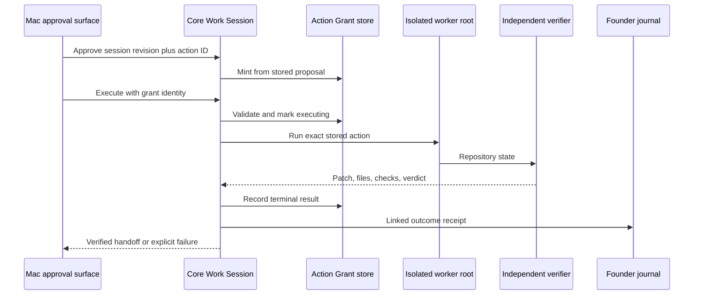
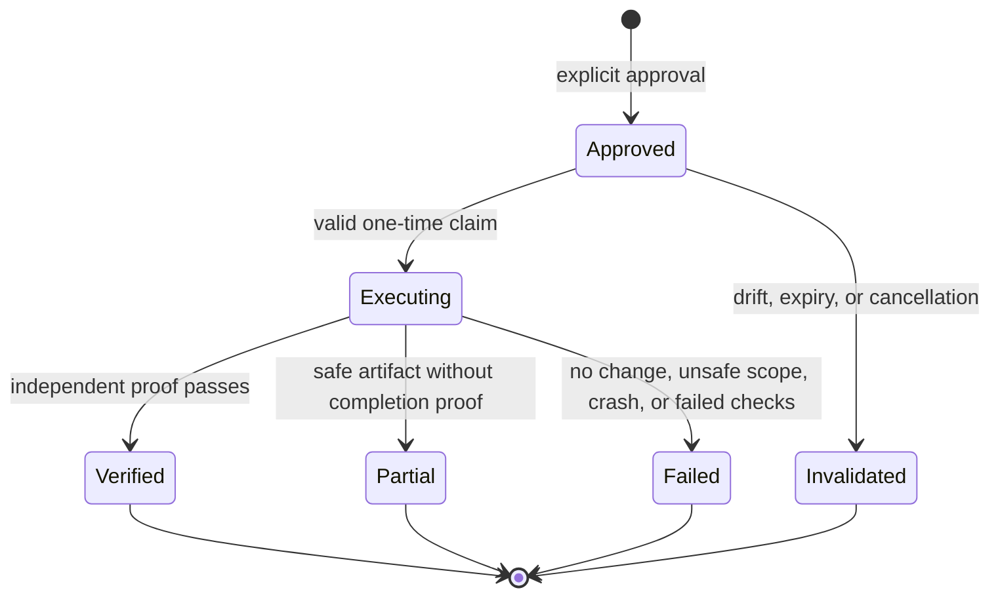

# Trustworthy Repository Outcomes - Plan

## Goal Capsule

Make Flyd's first executable V1 wedge trustworthy: an explicitly approved repository intervention must use a real, single-use grant, run in an isolated repository, produce filesystem and Git evidence, and write one linked outcome receipt.

Authority order:

1. The explicit action the user approved in the Mac surface.
2. The stored Work Session proposal and its repository fingerprint.
3. Current repository and verifier evidence.
4. Worker output, which is never completion evidence by itself.

The implementation stays inside the authenticated loopback TypeScript Core and thin Swift adapter. It reuses the current worker, verifier, worktree, and founder-journal primitives. It does not auto-integrate a worker result because the current UI does not display that consequence.

Stop and return an explicit failure if the proposal, session revision, grant, repository fingerprint, worker root, changed files, or verification evidence cannot be matched without inference.

## Product Contract

### Summary

Flyd must prove the chain from diagnosis to approved action to verified repository change. A plausible model response, a worker success message, or a long output string is not proof.

### Problem Frame

The repository-action endpoint currently accepts any non-empty grant ID. No production path mints a grant from the proposal Core generated, and Mac approval is recorded as an unsupported outcome status. Repository verification then infers changes from worker text, authorizes the foreground root while executing elsewhere, and deletes the isolated worktree it returns as a handoff. The founder journal records disconnected events with incorrect session linkage.

### Requirements

#### Authorization

- R1. Core must store each executable proposal with its diagnosis, evidence references, Work Session ID, revision, exact repository fingerprint, finish condition, and expiry.
- R2. Only an explicit Mac approval card that displays the immutable action, repository, allowed operation, finish condition, and expiry may mint a single-use Action Grant from that stored proposal.
- R3. Core must reject missing, unknown, stale, expired, invalidated, replayed, wrong-action, wrong-operation, or repository-mismatched grants before launching a worker.
- R4. Model or client fields must not create authority; executable proposal fields are bound or rejected at the trusted Core boundary.

#### Execution and verification

- R5. Repository work must execute inside an owner-only isolated managed worktree whose root is the only writable root used by the adapter, assignment, worker process, scope checks, and verifier.
- R6. Completion requires real changed files, a full binary patch digest, unchanged base HEAD, in-scope paths, and passing declared verification commands.
- R7. Worker prose and output length must not affect the verification verdict.
- R8. A verified unintegrated result must preserve its worktree and handoff location under bounded owner-only retention; a failed, empty, out-of-scope, expired, or explicitly discarded result may be cleaned safely.
- R9. The approved foreground repository must remain unchanged during isolated execution; source drift produces an unintegrated failure with preserved verified evidence.

#### Outcome evidence

- R10. Approval and terminal action records must share the Work Session ID, interaction ID, diagnosis ID, action ID, and grant ID.
- R11. The terminal receipt must record the approved source fingerprint, its post-run drift-check digest, isolated-worker before and after state digests, redacted changed files, patch digest, verification executable names and result digests, verdict, and handoff state without raw repository content.
- R12. Failed or partial actions must remain inspectable but must not count as verified improvement or project advancement.

### Key Product Decisions

- User approval is authority to execute one stored action, not permission to reinterpret or expand it. Governs R1-R4.
- Verification is independent of the executor. Governs R5-R9.
- The existing founder journal is the outcome receipt store for this slice. Governs R10-R12.

### Flow

- F1. Core produces and stores an executable proposal after grounding and diagnosis.
- F2. The Mac displays the immutable action scope, disables stale or incomplete approval, and submits the current session, revision, and action identity after explicit approval.
- F3. Core returns one expiring grant from the stored proposal to the Mac approval flow.
- F4. The Mac submits the grant identity to the repository-action endpoint, and Core atomically marks it executing before worker launch.
- F5. The worker runs in an isolated worktree, and Core verifies the real repository result independently.
- F6. Core preserves a verified handoff, updates the grant terminal state, writes a linked receipt, and returns an executing, verified, partial, failed, or stale-source result to the Mac.

### Acceptance Examples

- AE1. Covers R1-R4. A caller supplies a made-up grant ID with a valid repository root; Core rejects it before worker launch.
- AE2. Covers R2-R4. Approval for an earlier Work Session revision cannot execute after context changes.
- AE3. Covers R5-R7. A worker prints a convincing diff but changes no files; the result is failed with no verified progress.
- AE4. Covers R5-R9. A real tracked or untracked change with passing checks returns an actual patch digest and a preserved isolated handoff while the foreground checkout remains unchanged.
- AE5. Covers R8-R12. A failed verification records a linked failed receipt and cleans an empty or unsafe worktree without deleting a verified handoff.

### Success Criteria

- Every repository worker launch can be traced to one explicit approval and one stored proposal.
- Zero repository-action tests accept forged, stale, expired, replayed, or mismatched authority.
- Verification tests prove that filesystem and Git evidence override worker narration.
- One journal query by Work Session returns the proposal approval and terminal receipt with matching correlation IDs.

### Scope Boundaries

In scope:

- the Core and Mac approval contract for one repository action;
- server-owned grants and lifecycle transitions;
- isolated execution, independent verification, and preserved handoff;
- linked receipts in the existing founder journal.

Deferred to follow-up work:

- automatic integration, commit, push, deployment, or publishing;
- durable convergence of `AgentTask`, file goals, and ephemeral Work Sessions;
- passive complaint capture, classification, and correction routing;
- schema validation for all non-executable work-intelligence responses;
- GPT-5 transport repair outside this repository-action path;
- sidecar, proactivity, ambient sensors, glasses, and a generic Device Bridge.

## Planning Contract

### Key Technical Decisions

- KTD1. Core binds executable fields after model parsing and stores the proposal on the Work Session turn. The approval request carries identity only; it cannot replace root, instruction, finish condition, or fingerprint. (session-settled: user-approved — chosen over accepting client or model echoes: the user asked to execute the authorization-first correction.) Governs R1-R4.
- KTD2. Action Grants add operation, diagnosis, finish-condition, expiry, and terminal-use bindings. The store performs the approved-to-executing transition before the first asynchronous worker operation. Governs R2-R4.
- KTD3. Repository actions always use a `GitWorktreeManager` managed worktree in this slice. The same worker root is passed through adapter authorization, assignment, process working directory, scope checks, and verification. Governs R5 and R9.
- KTD4. `verifyWorkerResult` and `verificationCommandsForRepository` own proof. Repository action code consumes their structured evidence and does not implement a second output parser or command allowlist. Governs R6-R8.
- KTD5. Successful results remain unintegrated and preserve the managed worktree. Auto-integration stays disabled until the Mac surface displays and separately approves that consequence. Governs R8-R9.
- KTD6. A repository outcome receipt is a structured payload inside `FounderJournalEntry`, not a new store. It stores normalized repository-relative paths after secret-path redaction and executable identifiers without arguments. Raw patches, command output, repository content, and full command text remain outside the owner-only journal. Governs R10-R12.

### High-Level Technical Design

### System-Wide Impact

The HTTP contract, Swift payloads, Work Session lifecycle, worker root, verifier output, and journal schema change together. Golden request and response fixtures must prevent either process from dropping a safety field. Existing Rails, PostgreSQL orchestration, attention, and delegation code remain outside the dependency boundary.

### Risks and Dependencies

- The repository-action surface is dormant today. Core-only tests do not prove installed Mac execution, so the final gate must distinguish contract verification from installed-app proof.
- Verification commands may be expensive. Existing sandboxing and timeout behavior remain authoritative.
- Managed worktrees consume disk while preserved. Verified handoffs carry a disposition, expiry, and quota-visible size. Expired, rejected, or explicitly discarded handoffs are removed without touching active ones.
- Work Sessions remain process-memory state in this slice. Restart continuity is a separate V1 convergence unit, not implied by these receipts.

## Implementation Units

### U1. Bind proposals and mint real grants

**Goal:** Connect explicit Mac approval to one Core-owned, single-use repository Action Grant.

**Requirements:** R1-R4 and R10. Covers AE1 and AE2. Uses KTD1-KTD2.

**Dependencies:** None.

**Files:**

- `cli/src/work-intelligence/types.ts`
- `cli/src/work-intelligence/intervention.ts`
- `cli/src/work-intelligence/work-interaction-service.ts`
- `cli/src/work-intelligence/work-session-store.ts`
- `cli/src/server.ts`
- `mac-adapter/Sources/Bridge/WorkInteractionPayloads.swift`
- `mac-adapter/Sources/Bridge/FlydClient.swift`
- `mac-adapter/Sources/WorkInteraction/WorkInteractionCoordinator.swift`
- `cli/src/__tests__/intervention.test.ts`
- `cli/src/__tests__/work-session-store.test.ts`
- `cli/src/__tests__/repository-action.test.ts`
- `mac-adapter/Tests/WorkInteractionPayloadTests.swift`

**Approach:**

1. Bind the parsed proposal to the current interaction, diagnosis, revision, operation, and repository evidence before storing the turn.
2. Add a Core approval handler that resolves the stored proposal and mints the grant after exact identity and revision checks.
3. Add an atomic claim operation that rejects terminal, executing, expired, stale, or mismatched grants.
4. Return a typed approval response containing the bound session, revision, action, grant, operation, fingerprint, and expiry identities.
5. Render the immutable approval scope and disable approval for incomplete or stale proposals.
6. Map the safety fields explicitly across the Swift and Core contract.

**Execution note:** Start with failing store, authorization, and contract tests. Do not launch a worker in U1.

**Test Scenarios:**

- Missing executable fields make the proposal advisory-only.
- A valid current proposal can be approved once and claimed once.
- Unknown, expired, invalidated, executing, replayed, wrong-action, wrong-operation, or stale-revision grants fail.
- A context change invalidates pending grants.
- Swift round-trip fixtures retain session, revision, action, grant, operation, repository fingerprint, and expiry.
- The approval surface shows the stored repository, operation, finish condition, and expiry.
- Incomplete or stale proposals cannot enable approval.
- An unauthenticated approval request fails without minting a grant.

**Verification:** Approval creates a bound grant from server-owned state, and every forged or stale variant fails before an execution callback can run.

### U2. Verify the real isolated repository result

**Goal:** Replace output heuristics with independent Git, filesystem, scope, and command evidence.

**Requirements:** R5-R9. Covers AE3 and AE4. Uses KTD3-KTD5.

**Dependencies:** U1.

**Files:**

- `cli/src/work-intelligence/repository-action.ts`
- `cli/src/runtime/result-verifier.ts`
- `cli/src/runtime/verification-commands.ts`
- `cli/src/runtime/worktree-manager.ts`
- `cli/src/runtime/flyd-worker-tools.ts`
- `cli/src/server.ts`
- `mac-adapter/Sources/Bridge/WorkInteractionPayloads.swift`
- `mac-adapter/Sources/Bridge/FlydClient.swift`
- `mac-adapter/Sources/WorkInteraction/WorkInteractionCoordinator.swift`
- `mac-adapter/Sources/UI/AugmentPanel.swift`
- `cli/src/__tests__/repository-action.test.ts`
- `cli/src/runtime/__tests__/result-verifier.test.ts`
- `cli/src/runtime/__tests__/worktree-manager.test.ts`
- `cli/src/runtime/__tests__/flyd-worker-tools.test.ts`
- `mac-adapter/Tests/WorkInteractionPayloadTests.swift`

**Approach:**

1. Resolve the action only from the claimed grant and stored proposal.
2. Create an isolated managed worktree at the approved base HEAD for every run.
3. Make the existing filesystem and command sandbox a launch prerequisite with the isolated worktree as the only writable repository root.
4. Make the Swift approval flow submit the returned grant identity to the repository-action endpoint and render the terminal handoff or failure.
5. Derive verification commands from the repository and consume `verifyWorkerResult` evidence.
6. Define the worker state digest as SHA-256 over the base HEAD and normalized binary patch bytes, and expose both the base-state and changed-state values.
7. Preserve verified handoffs with owner-only permissions, disposition, bounded expiry, and quota-aware cleanup.
8. Render Mac states for approval submitted, executing, verified handoff, partial result, failed verification, source drift, retry, and dismissal.

**Execution note:** Add temporary-repository tests that demonstrate the old output heuristics fail before replacing them.

**Test Scenarios:**

- Convincing worker output with no filesystem change fails.
- Tracked, untracked, and binary changes produce real changed-file lists and patch digests.
- A worker or verification command that changes HEAD, creates an escaping symlink, exits nonzero, or times out fails verification.
- A worker tool that attempts an external write cannot modify an out-of-root sentinel.
- The adapter, assignment, process, scope check, and verifier all receive the isolated root.
- The Mac sends only the approved grant identity, and the terminal result returns to the same Work Session.
- Source drift blocks completion while preserving verified isolated evidence.
- Verified results preserve their handoff; empty and unsafe failures are cleaned.
- Active handoffs survive cleanup while expired, rejected, or discarded handoffs are removed.
- Every terminal Core verdict maps to a distinct Mac state with an inspectable handoff when one exists.

**Verification:** The result verdict can be reproduced from the preserved clone without reading worker output, and the foreground checkout fingerprint remains unchanged.

### U3. Record one linked intervention receipt

**Goal:** Make approval and execution outcomes queryable as one evidence chain.

**Requirements:** R10-R12. Covers AE5. Uses KTD6.

**Dependencies:** U1 and U2.

**Files:**

- `cli/src/work-intelligence/types.ts`
- `cli/src/work-intelligence/outcome-journal.ts`
- `cli/src/work-intelligence/work-session-store.ts`
- `cli/src/server.ts`
- `cli/src/__tests__/outcome-journal.test.ts`
- `cli/src/__tests__/work-intelligence-release-acceptance.test.ts`

**Approach:**

1. Record an approval entry when Core mints the grant.
2. Record exactly one terminal receipt for every successfully claimed grant, including worker and verifier failures; reject pre-claim requests without creating an intervention receipt.
3. Update the grant terminal status and result before returning the HTTP response.
4. Redact secret-like repository-relative paths and store verification executable identifiers without arguments.
5. Reject duplicate receipt IDs instead of overwriting prior evidence.

**Execution note:** Write the correlation and duplicate-ID tests before expanding the journal schema.

**Test Scenarios:**

- Approval and completion share session, interaction, diagnosis, action, and grant IDs.
- The receipt stores repository and command digests without raw patch or output content.
- Sensitive path fixtures are redacted, and command arguments never enter the journal.
- Verified, partial, and failed results map to distinct event types and cannot be counted interchangeably.
- Re-recording a receipt ID fails without modifying the original entry.

**Verification:** A Work Session journal query reconstructs the proposal-to-verdict chain and distinguishes verified improvement from partial or failed activity.

### U4. Prove the installed approval-to-receipt loop

**Goal:** Verify the real Mac interaction rather than infer it from package tests.

**Requirements:** R1-R12. Covers AE1-AE5.

**Dependencies:** U1-U3.

**Files:**

- `docs/product/founder-trial-runbook.md`
- `mac-adapter/Makefile`

**Approach:**

1. Install the built Core and Mac adapter through the supported Make target.
2. Invoke one repository proposal, inspect the displayed scope, approve it, and observe the executing and terminal states.
3. Inspect the preserved handoff and the matching journal chain.
4. Confirm the foreground checkout fingerprint stayed unchanged.
5. Record model-credential or macOS-permission failures as environment blockers, not successful product proof.

**Execution note:** This is an installed-app acceptance gate. Do not substitute a direct endpoint call for the Mac approval flow.

**Test Scenarios:**

- The displayed repository, operation, finish condition, and expiry match the stored proposal.
- Approval produces one grant, one worker run, one terminal verdict, and one linked receipt.
- The verified handoff is inspectable while the foreground checkout remains unchanged.
- Missing model credentials or macOS permissions stop the gate with an exact blocker.

**Verification:** The installed app completes one capture-to-approval-to-worker-to-verification flow, or the result is reported as package-verified but product-unverified with the exact blocker.

## Verification Contract

| Gate | Command | Proves |
|---|---|---|
| Focused Core | `cd cli && npm test -- src/__tests__/intervention.test.ts src/__tests__/work-session-store.test.ts src/__tests__/repository-action.test.ts src/__tests__/outcome-journal.test.ts src/__tests__/work-intelligence-release-acceptance.test.ts src/runtime/__tests__/result-verifier.test.ts src/runtime/__tests__/worktree-manager.test.ts` | Grant, verifier, worktree, receipt, and release behavior |
| Swift contract | `cd mac-adapter && swift test --filter WorkInteractionPayloadTests` | Safety fields survive the adapter contract |
| Core typecheck | `cd cli && npm run lint` | TypeScript contract consistency |
| Core build | `cd cli && npm run build` | Shippable Core output |
| Patch hygiene | `git diff --check` | No malformed patch content |
| Installed loop | `make -C mac-adapter install` followed by the U4 founder scenario | Real approval-to-receipt behavior |

Installed-app capture-to-approval-to-worker proof remains required before claiming the product interaction ships. If model credentials or macOS permissions prevent that gate, report the limitation separately from package verification.

## Definition of Done

- U1-U4 satisfy their test scenarios with red-before-green evidence for behavior changes.
- No repository worker can launch from a caller-supplied grant string alone.
- No repository action can be verified from worker output or output length.
- A verified isolated handoff survives long enough for independent inspection.
- One journal query reconstructs the approval and terminal evidence chain without raw repository content.
- Existing dependency-boundary checks still exclude Rails and generic orchestration.
- Focused tests, Swift contract tests, TypeScript lint, Core build, and patch hygiene pass or are reported with exact pre-existing failures.
- Abandoned implementation attempts and unused compatibility code are removed from the final diff.
