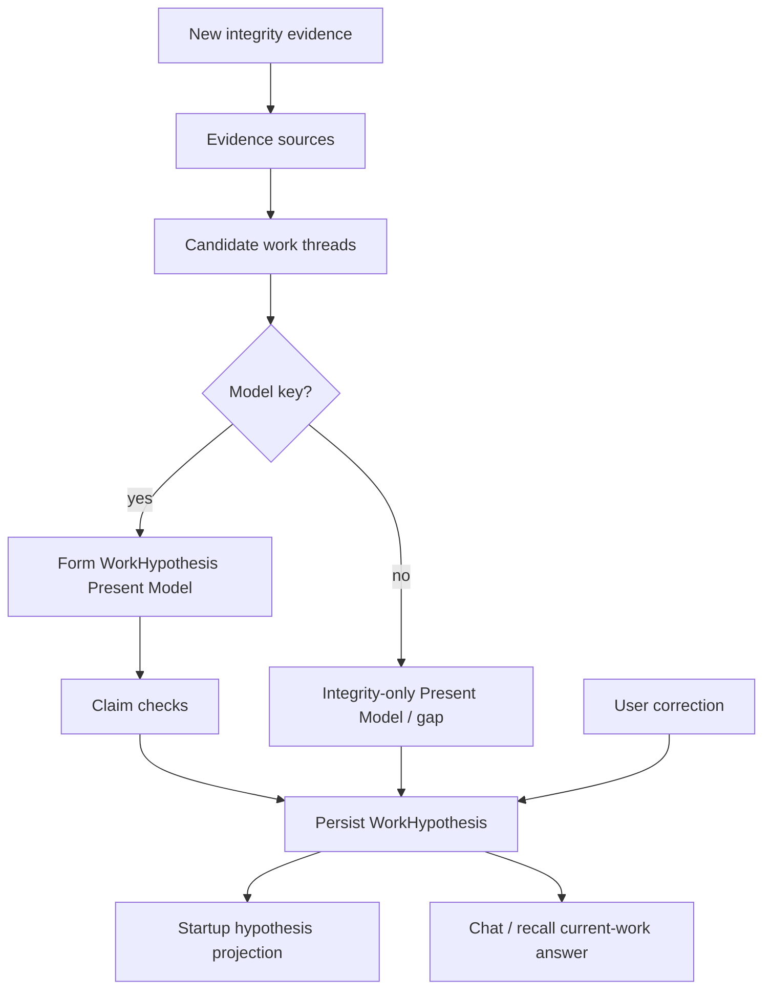

# feat: Shared work-hypothesis Present Model

## Summary

Replace Flyd’s catalog-style “active repos” dump with one shared, persistent, falsifiable work hypothesis. Candidate threads come from real activity evidence, sessions/tasks, and soft-durable corrections; the model forms a belief (with integrity-only fallback); startup and chat reuse the same Present Model. Deterministic rules stay integrity-only.

## Problem Frame

Startup and chat currently perform no shared intelligence about current work. Three parallel “present” paths exist: a cwd snapshot in `cli/src/lib/present-model.ts`, a SQLite `GlobalPresentModel` that labels every known repo “active,” and a CLI `BriefRepo` dump sorted dirty-first. Observation time is written as activity; dirty trees from months ago outrank recent commits; “what am I working on?” re-synthesizes from a Flyd-heavy catalog. A recency cutoff would only hide garbage. The product failure is missing belief formation, critique, and revision (PRD §11 project/currentness slice; STRATEGY context accuracy).

### §11 coverage (V1)

V1 Present Model ships a **subset** of PRD §11 Current Work Model: project/threads, optional objective, evidence refs, confidence, uncertainty, revised_at. Artifact, stage, constraints, open loops, and next meaningful action remain INVOKED/session Ground — not claimed done by the hypothesis line.

---

## Requirements

### Belief and surfaces

- R1. Flyd maintains one durable Present Model (work hypothesis) shared by CLI startup and chat answers about current work.
- R2. The Present Model is a falsifiable structured belief with provenance, confidence, uncertainty, and revised_at — not a ranked repo list and not a string-only display line.
- R3. Startup keeps greeting and weather; the repo dump (`crossRepoLine` / `+N more`) is replaced by a projection of that structured belief (or an honest gap).
- R4. “What am I working on?” (and equivalent intents) reads the same Present Model rather than performing a fresh catalog synthesis.

### Evidence and integrity

- R5. Candidate threads are assembled from real events: live verified commit timestamps, dirty-file state only as supporting signal when commit activity is recent, open work-index tasks, and user corrections.
- R6. Integrity guardrails (not intelligence): use real git commit times; never treat dirty alone as activity; never treat observation/scan time as activity; dedupe worktrees into one thread; Core `process.cwd()` never establishes primary work.
- R7. Belief confidence stays orthogonal to activity freshness (no “older ⇒ less true”).

### Formation, critique, correction

- R8. When a model key is available, Flyd forms a hypothesis from candidates and runs claim checks that reject unsupported primary-work claims (deterministic integrity predicates first; model narrative only for what integrity cannot decide).
- R9. Without a model key, Flyd surfaces an integrity-only belief or explicit gap — never invented narrative.
- R10. Soft-durable corrections: clear user contradiction of the hypothesis becomes `user_correction` evidence, revises the Present Model, and persists until stronger contrary integrity evidence supersedes it under R11 (no wall-clock decay flip in V1).
- R11. Latest user correction wins project claim until newer integrity evidence contradicts it under an explicit demotion rule (see KTD6); commits on a demoted project reinforce secondary status, not automatic primary reinstatement.

### Regression and scope posture

- R12. With founder-typical evidence (recent CleanX + Good Neighbours activity; Flyd dirty/cwd secondary; stale dirty trees like aigc/hashblocks), the hypothesis prioritizes Good Neighbours and CleanX, treats Flyd as secondary at most, and excludes year-old inventory from the hypothesis projection.
- R13. V1 writers are the shared engine called from startup/chat paths. INVOKED/LIVE write+refresh is out of this plan; do not maintain a second durable “current work” truth.

---

## Key Technical Decisions

- KTD1. **Intelligence over scoring catalog.** Do not ship Antigravity-style point totals as the product mind. Integrity-qualified candidates are the spine; model narrative (objective/re-entry) is enrichment when a key exists. Soft gates are admission filters, not a ranking product. Lock an integrity-only baseline that can already satisfy R12 naming before treating LLM form as load-bearing.
- KTD2. **Naming:** product belief = **Present Model**; module/type/store record = **WorkHypothesis**. Leave `cli/src/lib/present-model.ts` as the per-root cwd snapshot. House the new module under `cli/src/work/work-hypothesis/` as a durable projection of CurrentWork-shaped fields (project/threads/objective/uncertainty), not a sibling ontology that diverges forever from `CurrentWork`.
- KTD3. **Mirror EvidenceItem locally** for WorkHypothesis claim fields (`source`, `confidence`, `provenance`, `sourceTimestamp`, `isHypothesis`). Do not widen overlay `EvidenceItem` source unions unless INVOKED write is in scope.
- KTD4. **Persist in `~/.flyd/work-index.sqlite`.** Add hypothesis + correction event tables beside repositories/activities/tasks. Do not put Present Model truth in Rails/Postgres or in ephemeral `WorkSessionStore`.
- KTD5. **Repair activity timestamps at the source + backfill.** Stop writing observation time as work activity; add `observed_at` (or equivalent) separate from commit/work time. Candidate admission prefers **live git** (`getRecentCommits` / equivalent). Writer fix is forward-only; U1 must backfill or recompute existing poisoned rows and audit readers of `last_activity_at` (`listRepositories`, recall freshness, repos CLI, `buildGlobalPresentModel`).
- KTD6. **Soft-durable demotion algebra (V1).** A correction that demotes a named project is a hard demotion constraint until explicit reaffirm or clear multi-signal reopen. Commits on a demoted project do not reinstate it as primary. No unreaffirmation/decay state machine in V1.
- KTD7. **Foreground vs stored belief.** Live foreground can establish project identity for the current interaction; objective/thread may remain hypothesized with uncertainty. Foreground alone does not prove primary multi-project work at startup. When Present Model and session `CurrentWork.project` disagree, consumers must cite which wins and label the other uncertain — no silent dual answers.
- KTD8. **V1 write path.** One engine writes the store (startup refresh + chat correction/revision). INVOKED/LIVE not wired in this plan (hard defer).
- KTD9. **Attention engine stays out.** Multi-dimension attention scoring is not the Present Model path.

---

## High-Level Technical Design

### Belief pipeline

### Surfaces vs stores (target)

| Surface | Today | After |
|---------|-------|-------|
| CLI `introLine` | `crossRepoLine` dump | Present Model projection or gap |
| Recall `active_projects` | Catalog from `GlobalPresentModel` | Same Present Model belief |
| Chat “what am I working on?” | cwd `situation` + `crossRepoContext` dump | **Replace** catalog context with Present Model read; demote cwd project authority for those intents |
| `lib/present-model.ts` | Per-root snapshot | Remains input evidence, not global belief |
| INVOKED `CurrentWork` | Session-ephemeral | Unchanged in this plan (follow-up) |

### Integrity vs intelligence

| Layer | Owns |
|-------|------|
| Integrity (deterministic) | Live commit timestamps, dirty≠activity, worktree dedupe, no cwd authority, demotion constraints, claim checks |
| Intelligence (model) | Objective/re-entry narrative beyond admitted thread names — only when key present |
| Persistence | Structured WorkHypothesis (Present Model), evidence refs, correction log, revised_at |

---

## Scope Boundaries

### In scope

- WorkHypothesis store + candidate integrity (live git + timestamp repair/backfill), form/claim-check/fallback, startup + chat/recall consumers, soft-durable demotion corrections, R12 regression tests.

### Out of scope

- Stale-repo display filters as the product fix (`FLYD_ACTIVE_DAYS` catalog cutoffs).
- Attention-engine multi-score ranking as Present Model.
- INVOKED/LIVE Ground rewrite, read wiring, or write parity (follow-up).
- Removing greeting/weather art.
- Persisting raw external evidence into personal memory.
- Rails / Postgres belief tables.
- Wall-clock correction decay / unreaffirmation machinery.
- Ephemeral session/artifact stores as restart-safe candidate sources (V1 uses live commits, dirty support, work-index tasks, corrections).

### Deferred to Follow-Up Work

- INVOKED/LIVE consume and eventually write the same Present Model (thin seed then parity).
- Wiki promotion of every Present Model correction.
- Unifying duplicate root scanners (`FLYD_WORK_ROOTS` defaults) beyond integrity needs.
- Full §11 field set on the durable belief.

---

## Implementation Units

### U1. Integrity evidence and candidate threads

- **Goal:** Produce integrity-admitted candidate work threads from real activity signals.
- **Requirements:** R5, R6
- **Dependencies:** None
- **Files:**
  - create: `cli/src/work/work-hypothesis/candidates.ts`
  - modify: `cli/src/work/git-observer.ts`
  - modify: `cli/src/work/repository-registry.ts`
  - modify: `cli/src/work/database.ts` (observed_at / migration guard as needed)
  - modify: `cli/src/lib/recent-commits.ts` (reuse if needed)
  - test: `cli/src/work/work-hypothesis/__tests__/candidates.test.ts`
- **Approach:** Prefer live git commit times for admission. Admit dirty only as support when recent commit activity exists (threshold chosen in characterization; document constant). Fix writers so commit `occurred_at` uses author/committer time; separate observe time; stop dirty-only observes from refreshing work activity. Backfill or recompute poisoned history. Audit `last_activity_at` consumers. Dedupe worktrees. Exclude Core cwd as primary evidence. Emit provenance per signal; freshness is admission/provenance, not belief confidence.
- **Execution note:** Characterization-first for timestamp/dirty behavior; include pre-migration DB fixtures.
- **Patterns to follow:** `cli/src/lib/recent-commits.ts`; EvidenceItem-style provenance; do not copy dirty-as-activity from older notes.
- **Test scenarios:**
  - Happy path: recent CleanX + Good Neighbours commits are admitted; Flyd dirty-only is not admitted as an activity/primary candidate.
  - Edge: worktree pair collapses to one thread.
  - Edge: dirty repo with last commit 11 months ago is not admitted.
  - Error/integrity: observation/scan does not stamp commit `occurred_at`.
  - Integration: pre-migration poisoned SQLite fixtures still yield correct admission when live git is preferred / after backfill.
- **Verification:** Assembler returns the integrity-admitted set with real timestamps and no dirty-only primaries.

### U2. Durable Present Model store

- **Goal:** Persist one structured WorkHypothesis (Present Model) with provenance and correction events.
- **Requirements:** R1, R2, R10, R13
- **Dependencies:** None
- **Files:**
  - create: `cli/src/work/work-hypothesis/types.ts`
  - create: `cli/src/work/work-hypothesis/store.ts`
  - modify: `cli/src/work/database.ts`
  - test: `cli/src/work/work-hypothesis/__tests__/store.test.ts`
- **Approach:** SQLite tables for current hypothesis + correction/revision log. Typed fields for primary/secondary threads, optional objective, confidence, uncertainty, evidence refs, revised_at — display line is a projection only. Include one-shot ALTER/PRAGMA guard pattern for new columns. Read API returns latest belief or gap-ready empty. Write API supersedes with provenance.
- **Patterns to follow:** `cli/src/work/database.ts`; mirror EvidenceItem fields locally.
- **Test scenarios:**
  - Happy path: write structured hypothesis → read returns same threads/confidence/uncertainty.
  - Edge: empty store → gap-ready empty state.
  - Integration: correction event supersedes prior primary project claim.
  - Failure: corrupt/missing DB recovers without throwing into startup.
- **Verification:** Round-trip from temp work-index DB; no Postgres/Rails dependency; reject string-only “belief.”

### U3. Form, claim checks, and fallback

- **Goal:** Turn candidates into a revised Present Model via integrity claim checks + optional model narrative, or integrity-only fallback.
- **Requirements:** R7, R8, R9, R12
- **Dependencies:** U1, U2
- **Files:**
  - create: `cli/src/work/work-hypothesis/engine.ts` (inline claim checks; no separate critic module required)
  - test: `cli/src/work/work-hypothesis/__tests__/engine.test.ts`
- **Approach:** Load candidates + prior hypothesis + demotion constraints. Integrity-only path must already satisfy R12 thread naming. With model key, add objective/re-entry narrative without overriding demotion/integrity predicates. Persist through U2. Reuse prior belief when evidence unchanged.
- **Execution note:** Test-first on R12 fixture and no-key fallback before wiring UI. Prove integrity-only baseline before relying on LLM.
- **Patterns to follow:** `cli/src/lib/currentness-gate.ts`; confidence≠freshness learning.
- **Test scenarios:**
  - Happy path: R12 fixture → structured belief names Good Neighbours and CleanX; Flyd secondary or excluded from primary.
  - Happy path: claim checks drop unsupported primary when evidence is only dirty/cwd.
  - Edge: no model key → integrity-only/gap; no invented objective.
  - Edge: prior hypothesis reused when evidence unchanged.
  - Failure: model error → integrity fallback without crashing startup.
- **Verification:** Engine tests lock R12 structured shape; no-key path never fabricates work.

### U4. Soft-durable corrections

- **Goal:** User contradictions revise the Present Model under the demotion algebra.
- **Requirements:** R10, R11
- **Dependencies:** U2, U3
- **Files:**
  - create: `cli/src/work/work-hypothesis/corrections.ts` (thin helper; may live beside engine if small)
  - modify: `cli/src/runtime/conversation-responder.ts` (or turn-repair ingress)
  - test: `cli/src/work/work-hypothesis/__tests__/corrections.test.ts`
- **Approach:** Detect clear contradiction of the current hypothesis in chat; record `user_correction`; apply demotion constraint; persist. Thrash regression required. Latest correction wins until superseded under KTD6.
- **Patterns to follow:** memory-gate / turn-repair correction capture; `user_correction` source string compatibility.
- **Test scenarios:**
  - Happy path: “don’t treat Flyd as primary” → demotion persists across reload.
  - Edge: two sequential corrections — latest project claim wins.
  - Thrash: demote Flyd → inject Flyd commits → primary does not rebound without reaffirm.
  - Integration: corrected belief is what startup and chat both read.
- **Verification:** Correction survives restart; demotion constraint inspectable.

### U5. Wire startup and chat consumers

- **Goal:** Startup and current-work chat/recall share one structured belief surface.
- **Requirements:** R1, R3, R4, R13
- **Dependencies:** U3
- **Files:**
  - modify: `cli/src/runtime/agent-session.ts`
  - modify: `cli/src/commands/code.ts`
  - modify: `cli/src/runtime/conversation-responder.ts`
  - modify: `cli/src/work/recall-router.ts`
  - modify: `cli/src/runtime/repo-registry.ts` (stop using dump as present mind; keep scan helpers if needed)
  - test: `cli/src/runtime/__tests__/repo-registry.test.ts`
  - test: `cli/src/work/work-hypothesis/__tests__/surfaces.test.ts`
- **Approach:** Replace `crossRepoLine` in `introLine` with Present Model projection. For current-work intents, **replace** (not append) `crossRepoContext` and demote cwd `situation` project authority. Route recall `active_projects` through the same read API. Do not leave catalog dump as silent fallback. Do not wire INVOKED in this unit.
- **Patterns to follow:** existing greeting/weather structure.
- **Test scenarios:**
  - Happy path: intro has greeting/weather + belief projection; no dirty-sorted dump / `+N more` names.
  - Happy path: chat current-work question returns persisted structured belief (not cwd Flyd catalog).
  - Integration: after correction in chat, next intro reflects revised belief.
  - Edge: empty/gap state shows honest gap copy, not “Active projects:” inventory.
- **Verification:** Surface tests lock no-dump + shared-read behavior; AE4 no-key honesty remains a ship gate (not dump removal alone).

---

## Acceptance Examples

- AE1. **Startup belief.** Given recent commits on Good Neighbours and CleanX, Flyd dirty/cwd secondary, and stale dirty aigc — when George starts `flyd`, the intro projects Good Neighbours and CleanX as active threads (Flyd secondary at most) and does not list aigc/hashblocks.
- AE2. **Shared read.** Given a persisted Present Model from startup — when George asks “what am I working on?”, the answer reuses that belief rather than cwd/`crossRepoContext` catalog synthesis.
- AE3. **Correction authority.** Given Flyd wrongly treated as primary — when George corrects it, subsequent startup and chat keep the demotion even if Flyd receives new commits, until explicit reaffirm or multi-signal reopen.
- AE4. **No-key honesty.** Given no model API key — when startup runs, Flyd shows integrity-only or gap text and does not invent an objective narrative.

---

## System-Wide Impact

- **CLI startup UX:** catalog → belief projection (dogfood/continuity surface for this plan).
- **Work index SQLite:** new tables; activity timestamp semantics change; backfill required for existing founder DBs.
- **Naming:** Present Model (product) / WorkHypothesis (type) ≠ `lib/present-model.ts` snapshot.
- **Overlay:** no Swift changes; INVOKED not wired here. PRESENT remains zero-network.
- **STRATEGY:** serves context accuracy for CLI continuity; PRD §16.4 overlay context-accuracy credit waits until INVOKED follow-up.
- **Failure propagation:** engine/store failures degrade to gap/integrity-only inside `introLine` — never block the REPL.
- **Cache coherence:** BriefRepo 30s cache must not reintroduce dump ranking beside Present Model for present intents.
- **Dual-truth risk:** session `CurrentWork` stays ephemeral; disagreeing surfaces must label uncertainty (KTD7). No silent SQLite overwrite from ephemeral Ground.

---

## Risks & Dependencies

| Risk | Mitigation |
|------|------------|
| Point-scoring or string-only “belief” creeps back | KTD1–KTD2; structured store tests; integrity-only R12 baseline |
| Poisoned historical SQLite times | Live-git candidates + backfill + consumer audit (KTD5) |
| Dual truth with `CurrentWork` | KTD2/KTD7; INVOKED write deferred; explicit precedence when disagreeing |
| Form+critic theater | Integrity claim checks are the spine; LLM optional enrichment |
| Soft-durable thrash on home repo (Flyd) | KTD6 demotion algebra + thrash regression |
| Model latency on startup | Reuse when evidence unchanged; timeout + integrity fallback |
| Correction false positives | High-precision contradiction of current hypothesis only |

**Dependencies:** work-index SQLite; model key optional; git for live commit times.

---

## Open Questions

- OQ1. Exact correction ingress copy patterns (free-text vs explicit command) — resolve during U4 against turn-repair / memory-gate; prefer high precision.
- OQ2. Whether WorkHypothesis should later physically merge into `work-intelligence/` beside `CurrentWork` — V1 path under `work/work-hypothesis/` is fine if field contract stays CurrentWork-compatible.

---

## Sources & Research

- Origin product authority: `docs/product/flyd-work-intelligence-prd.md` §11 Current Work Model
- Related plans: `docs/plans/2026-08-02-001-feat-work-intelligence-loop-plan.md`, `docs/plans/2026-08-03-001-feat-earn-invoke-by-observing-plan.md`
- Learnings: `docs/solutions/architecture-patterns/flyd-work-intelligence-pipeline-2026-08-05.md`, `docs/solutions/architecture-patterns/decouple-confidence-from-freshness-2026-07-28.md`
- Code seams: `cli/src/runtime/agent-session.ts`, `cli/src/runtime/repo-registry.ts`, `cli/src/runtime/conversation-responder.ts`, `cli/src/work/repository-registry.ts`, `cli/src/work/git-observer.ts`, `cli/src/work/recall-router.ts`, `cli/src/work-intelligence/types.ts`, `cli/src/lib/present-model.ts`
- External research: skipped — local EvidenceItem / currentness / PRD patterns were sufficient
- Doc review (headless): coherence + feasibility + product-lens + scope-guardian + adversarial; safe_auto applied above
