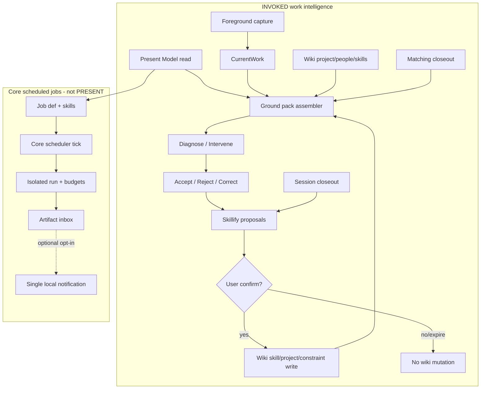
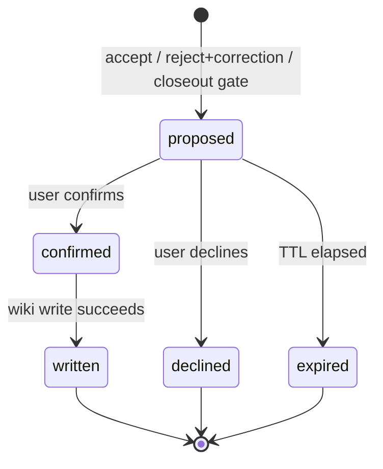

# feat: Ground pack, skillify, and bounded overnight work jobs

## Summary

Make Flyd compound like personal AGI for work: open a deterministic Ground pack (“three books”) before diagnosis, skillify durable judgment into user-owned wiki markdown with confirmation, and run bounded user-authorized overnight jobs that deliver briefings and prep — never PRESENT cognition, never a general autonomous assistant.

## Problem Frame

Flyd already has memory wiki, librarian retrieval, session closeout, domain standards, and a Present Model (work hypothesis). The daily loop still behaves like a smart prompt with nearby memory:

- Ground builds `CurrentWork` and may race intent retrieval, but does not assemble a capped, labeled pack of project + people + domain skill + colleague preload.
- Domain standards are hardcoded in Core; user judgment does not live in portable skill files that steer Diagnose.
- Closeout “promotes” learnings into journal receipts without user-confirmed wiki writes; crystallize can still blind-write wiki pages.
- There is no Core work-intelligence job runner for morning briefings / meeting prep / queued research — only memory-daemon intervals and legacy Rails cron.

Gary Tan’s personal-AGI thesis maps cleanly onto Flyd’s PRD (capability compounds when context and skills are owned), but STRATEGY and PRD forbid general-purpose autonomous background assistants and speculative PRESENT cognition. This plan expands into overnight work **only** as explicit, budgeted, user-authorized jobs.

Product authority: `docs/product/flyd-work-intelligence-prd.md` (Ground → Learn; §12.6; §14.3 exclusions). Builds on Present Model: `docs/plans/2026-08-12-001-feat-work-hypothesis-engine-plan.md` (INVOKED write still deferred; this plan adds **read** into Ground).

---

## Requirements

### Ground pack

- R1. Before Diagnose on INVOKED work-intelligence, Core assembles a deterministic **Ground pack** from: session `CurrentWork`, Present Model (read), wiki project page (if any), relevant people pages, domain standard (wiki skill preferred), and a colleague-preload summary.
- R2. Pack is size-capped and priority-trimmed; missing pages become explicit gaps, never invented content.
- R3. Foreground outranks durable memory for current-state claims. When Present Model and foreground project disagree, pack cites the winner and labels the other uncertain (align related plan `docs/plans/2026-08-12-001-feat-work-hypothesis-engine-plan.md` KTD7 — not this plan’s KTD7).
- R4. Colleague preload states what Flyd already knows that could change the intervention, labeled background, never overriding foreground facts.
- R5. Next INVOKED after closeout injects matching-project closeout fields (`nextAction`, unresolved, last verified state) into the pack; Skillify proposals are not diagnosis context until wiki write succeeds (`skillify_written` / on-disk file) — `proposed`, `confirmed` (pre-write), `declined`, and `expired` never steer Diagnose.

### Skillify

- R6. On accept, reject+correction, and session closeout, Flyd may propose promoting durable judgment into user-owned wiki markdown (`standards/`, `projects/`, `constraints/`, or equivalent existing folders) with provenance. Identity `skills/` pages remain personal proficiency notes — not Diagnose domain-standard candidates.
- R7. No wiki write without explicit user confirmation. Blind crystallize/auto-write paths must not be the Skillify path.
- R8. Proposals follow state `proposed → confirmed → written | declined | expired`. Unconfirmed proposals expire without wiki mutation.
- R9. Reject alone does not propose; reject+correction or a repeated identical reject pattern may propose one negative constraint/skill.
- R10. Spam caps: coalesce duplicates, max pending proposals, at most one project-page creation proposal per project until resolved.
- R11. Written wiki skills (`skillify_written`) are retrievable into future Ground packs / Diagnose standards. Journal receipts reflect `skillify_proposed` vs `skillify_written` — no dual “promoted” truth when wiki was never written.

### Bounded overnight jobs

- R12. User can authorize recurring work-intelligence jobs with explicit goal, schedule, skill ids, tool policy, budgets, delivery, and write mode.
- R13. Jobs run in Core (not PRESENT). PRESENT remains zero-network / zero-persistence / no cognition.
- R14. Default write mode for scheduled outcomes is **artifact delivery** (briefing / prep / research draft inbox), not silent personal-memory mutation. Memory/wiki mutation from jobs requires propose/confirm or a scoped revocable standing grant.
- R15. Hard budgets: wall-clock, idle timeout, token/tool caps, max concurrent scheduled runs (start at 1), global pause/kill switch, no recursive schedule mutation inside a run, fail closed on missing skills/credentials.
- R16. **Phase C MVP job type:** morning briefing from Present Model + active project wiki only. Delivery is pull-first (Core-owned artifact via CLI/`flyd jobs`); OS notification deferred to follow-up. Meeting prep and queued research are post-briefing follow-ups (see Deferred).
- R17. Sleep/offline: skip or single catch-up for most recent miss; no backlog replay.

### Measurement / privacy

- R18. Instrument whether Ground pack improved context accuracy and whether confirmed skills changed later interventions (PRD §12.6 P1 / STRATEGY metrics).
- R19. Overnight and Skillify paths remain auth-gated; audits omit raw screen/audio; falsify PRESENT invariant still holds.

---

## Key Technical Decisions

### KTD1. Three-book assembler, not more retrieval

**Decision:** Ground pack is a deterministic assembler with a fixed priority list and char/token budget. Pack fields are first-class prompt sections with provenance labels. Intent/QMD retrieval may still enrich *below* the pack, never replace labeled sections.

**Why:** Diagnose already fails when context is soft-relevant history rather than the right books. Another retrieval race compounds latency and invents soft relevance; an assembler makes gaps explicit and trim order falsifiable.

**Tradeoffs:** Assembler can miss a surprising but useful page that retrieval would surface. Accept that miss in V1; founder can correct, and Skillify/wiki grow the deterministic set. Assembler I/O must stay bounded (sync wiki/store reads + hard timeout) — pack content is never LLM-synthesized.

**Rejected alternatives:**
- Unbounded QMD/librarian as primary Ground context (recreates “smart prompt + nearby memory”).
- LLM “pack composer” that narrates project/people/standard (dual truth with wiki; non-falsifiable).
- Expanding CurrentWork fields only (no labeled multi-source pack; colleague preload and closeout resume stay second-class).

### KTD2. Conflict algebra (INVOKED)

**Decision:** Foreground wins **project identity** for this interaction. Present Model attaches as secondary/uncertain when it disagrees. Diagnose evaluates foreground work; ask only if objective conflict is material and blocking. Do not silently merge two projects into one standard.

**Why:** Aligns related Present Model plan KTD7 (`2026-08-12-001` … work-hypothesis) and PRD foreground-over-memory. Silent merge poisons domain standard selection and colleague preload.

**Tradeoffs:** User may want Present Model primary when foreground capture is wrong (wrong app/doc). Mitigation: correction path revises session CurrentWork; ask only when conflict blocks the intervention objective.

**Rejected alternatives:** Present Model always wins; majority vote; soft blend of two project names into one Diagnose prompt.

### KTD3. Present Model: read now, write still deferred

**Decision:** Consume `work/work-hypothesis` store in INVOKED Ground. Do not reopen the completed Present Model plan’s INVOKED write scope.

**Why:** Read closes the “three books” gap without reopening writer thrash (dual CurrentWork/hypothesis writers). Write remains owned by the prior plan’s follow-up.

**Tradeoffs:** Stale Present Model can appear as labeled secondary noise until INVOKED write ships. Prefer explicit uncertain labels over inventing freshness.

**Rejected alternatives:** INVOKED write in this plan; ignoring Present Model until write parity.

### KTD4. Wiki domain standards are the long-term Diagnose skill home

**Decision:** Skillify **domain/work standards** land in `~/.flyd/wiki/standards/` with frontmatter `type: domain_standard` (DomainStandard-compatible: evaluationDimensions / focusPrompt / avoidances). Identity proficiency pages stay in `~/.flyd/wiki/skills/` (`type: skill`) and are **never** DOMAIN_STANDARD candidates. Hardcoded `domain-standards.ts` remains **fallback** when no matching *written* domain_standard page exists or shape validation fails. Skillify promotes/updates the wiki standard that then wins next Ground.

**Why:** Compounding requires user-owned, portable judgment (STRATEGY / PRD Phase 3). Reusing identity `skills/` collides with compile-context `current_identity` buckets and freeform proficiency bodies — different shape from Diagnose standards. A dedicated folder + frontmatter type reuses existing wiki mechanics without a new DB ontology.

**Tradeoffs:** Wiki standards can be wrong, stale, or malformed. Mitigate with: confirm-before-write; shape validation against `DomainStandard`; corrupt/invalid wiki → fallback + gap provenance `fallback:domain-standards`; non-written Skillify states never steer Diagnose (R5).

**Rejected alternatives:**
- Replace hardcoded standards entirely in V1 (regresses Diagnose before compounding exists).
- Overload identity `skills/` for DomainStandard pages (pollutes current_identity retrieval).
- New skill ontology / DB tables / `.opencode/skills` for user judgment (forks memory; violates “no new ontology”).
- Auto-merge Skillify into hardcoded TS (not user-owned; not portable).

### KTD5. Skillify confirmation UX (batch closeout + mid-session)

**Decision:** Default confirm surface is **batch at session closeout** via interactive augment. **V1 AugmentPanel contract (load-bearing):** flat single-shot options only — per-proposal `Accept <id>` / `Decline <id>` plus `Accept all` / `Decline all`; one click posts one Core action then dismisses; remaining proposals stay pending for a later closeout or CLI. Escape / click-outside / auto-dismiss = **leave pending** (never decline, never write). Skillify confirm cards **disable** the 30s auto-dismiss timer. Mid-session confirm only for reject+correction proposals, and **only after** the WorkIntervention card is dismissed — never call `show()` while intervention is active. Unconfirmed proposals expire (default TTL 7 days). Pending store is Core-owned under `~/.flyd/`. CLI confirm (`flyd skillify list|show|confirm|decline`) is required fallback.

**Closeout transport:** `/manifest/outcome` closeout must return pending Skillify proposal ids (or a follow-up poll endpoint) so the adapter can render the confirm card — `{ acknowledged: true }` alone is insufficient.

**Session close rule:** Accept outcomes that create Skillify proposals must also trigger session closeout (or an explicit closeout-equivalent propose gate) so batch confirm can fire; `succeeded` alone must not strand accept-derived proposals until TTL.

**Why:** Closeout is when judgment residue is natural and least interruptive. AugmentPanel `.show()` dismisses prior panels — multi-select batch is not available; single-shot flat options match existing execution-card patterns.

**Tradeoffs:** Batch delays compounding until closeout; mid-session can still interrupt. Cap mid-session to correction-class only.

**Rejected alternatives:**
- Auto-write on accept (blind crystallize; violates R7).
- Confirm-every-accept mid-session (spam → ignore).
- Closeout-only with no mid-session correction confirm (breaks high-agency “remember this now”).
- PRESENT or AttentionEngine interrupt for pending skillify (forbidden proactivity).
- Multi-select AugmentPanel batch (not supported; `.show()` dismisses prior panels).

### KTD6. Receipts ≠ confirmed wiki

**Decision:** Split journal events: `skillify_proposed` (pending) vs `skillify_written` (file exists). Do not use `learning_promoted` to mean wiki mutation. Confirmed write sets wiki frontmatter provenance and only then flips receipt to written.

**Why:** Dual-memory risk is the main Skillify integrity failure — journal “promoted” while wiki never written, or crystallize writing while Skillify pending claims the same residue.

**Tradeoffs:** Slightly noisier journal taxonomy. Worth it for audit honesty and founder metrics (R18).

**Rejected alternatives:** Overloading `learning_promoted`; treating proposal store as canon; crystallize as Skillify backend.

### KTD7. Overnight = in-Core scheduler + optional LaunchAgent for Core liveness

**Decision:** Job tick runs inside long-lived TypeScript Core (same process as `/manifest` server). **Phase C ships U7a first:** morning-briefing job type + `flyd jobs run morning-briefing` (manual/one-shot) + artifact inbox + budgets — no in-Core 60s tick until a measured Core-up gap. **U7b (deferred within Phase C):** in-Core scheduler tick + catch-up only after dogfood proves residency need (same bar as LaunchAgent). Use launchd **only** as optional LaunchAgent to keep Core alive — never LaunchDaemon-as-agent, never a separate overnight binary, never Rails/Sidekiq, never PRESENT.

**Fire idempotency:** Catch-up keys on `(jobId, scheduleSlot)` wall-clock slot, not bare Core start — prevents crash-loop double-fire.

**Overnight project resolution (no foreground):** Morning briefing requires explicit job `projectId` or a fresh Present Model primary; stale PM alone must not silently pick project. Do not reuse `resolvePackProject(foreground, presentModel)` unchanged when foreground is absent.

**Why:** Hermes/OpenClaw pattern: authority, budgets, tool policy, and audit live where work-intelligence already lives. One-shot CLI proves pull-first value without always-on residency bet.

**Tradeoffs:** If user quits Fly.app and no LaunchAgent, scheduled briefing does not run until U7b — correct for V1. LaunchAgent blurs “app quit means stop”; if added, it must only `npm run core`, honor pause/kill, and must not register PRESENT observers.

**Rejected alternatives:**
- launchd plist that *is* the agent (bypasses Core auth, budgets, wiki paths).
- Separate overnight Node process with duplicated WI imports (split brain).
- Rails cron / Sidekiq (legacy; AGENTS.md forbids).
- Daemon curiosity/tension/attention cycles as the overnight product (KTD10).
- In-Core 60s tick as Phase C day-one requirement (residency bet before briefing artifact is proven).

### KTD8. Job = authority instance; skill = procedure

**Decision:** V1 JobDef carries `schedule` (local-timezone daily `HH:MM` for MVP), `skillIds`, `prompt`, `toolPolicy`, `budgets`, `delivery`, `writeMode=artifact`, `enabled`, optional `projectId`. No `grantExpiresAt` or non-artifact writeMode in V1 (standing grants deferred). Skills encode how; jobs encode when/caps/authority. Isolated fresh session per fire. **Effective tools = job `toolPolicy` ∩ type-hard allowlist in Core.** Morning-briefing allowlist: wiki/PM/closeout read + local compose only — **no evidence network**. Always deny: schedule mutation, wiki write, PRESENT/adapter bridges, credential-exfil helpers. Job JSON cannot widen past the type ceiling. `skillIds` resolve only as slugs under allowlisted wiki folders (`standards/`, `constraints/`); reject path separators and `..`.

**Why:** Separates compounding judgment (skills) from delegated authority (jobs). Prevents autonomy creep and path traversal via crafted JobDef JSON.

**Tradeoffs:** Slightly more schema than a cron string + prompt. Required for tool allowlists and writeMode. Type ceilings must be updated deliberately when adding job kinds.

**Rejected alternatives:** Cron that inlines full procedure with no skill id; skills that mutate their own schedule; trusting job-stored `toolPolicy` as the sole authority.

### KTD9. Artifact-first overnight writes (not memory mutation)

**Decision:** Default `writeMode=artifact`: scheduled outcomes land in Core-owned artifact inbox (`~/.flyd/overlay/job-artifacts/`). Memory/wiki/Present Model mutation from jobs requires propose/confirm or a scoped revocable standing grant — **MVP ships artifact-only**. Disable schedule-mutation tools inside scheduled runs. Artifacts are **not** auto-injected into Ground pack; INVOKED may later *optionally* cite a user-opened or explicitly linked briefing as labeled enrichment (deferred unless founder dogfood demands it).

**Why:** STRATEGY forbids general autonomous background assistants. Artifact delivery is pull-first work product; silent wiki mutation creates dual-memory and unverified “learning.” The mermaid diagram deliberately omits any `ART → PACK` edge; optional INVOKED citation of a user-opened briefing is aspirational follow-up, not V1 auto-wire.

**Tradeoffs:** Morning briefing will not automatically change Diagnose until user reads/acts — intentional. Standing grants deferred (Scope Boundaries).

**Rejected alternatives:** Silent wiki upsert from overnight; auto-promote artifacts into skills/; AttentionEngine push of briefing into PRESENT.

### KTD10. Borrow daemon liveness patterns, not daemon product or shared spend ledger

**Decision:** Reuse **PID liveness** patterns from `cli/src/commands/daemon.ts`. **New** overnight pause/kill files and per-run wall-clock/tool caps (R15) — `daemon.ts` has no pause API. Optionally share `lib/budget.ts` dailyCap as a global backstop only; overnight spend ledger must be **isolated** from memory-daemon curiosity/tension cycles. Do not route overnight WI through curiosity/attention/tension report cycles.

**Why:** Budget/pause *patterns* are proven; daemon *product* goals and shared dailyCap are not overnight-specific controls.

**Rejected alternatives:** Reusing AttentionEngine interruption budgets as overnight UX; coupling job runner to memory-daemon tick.

### KTD11. Colleague preload sources

**Decision:** Wiki project + people + matching closeout + Present Model objective/uncertainty only. **Colleague preload = deterministic formatting** of already-selected pack excerpts (bulleted excerpts + provenance labels) with a hard char cap — **no model calls** inside the assembler path. Label as background. Exclude non-written Skillify states, raw dumps, and overnight artifacts unless explicitly linked.

**Why:** Preload must change the intervention without overriding foreground facts (R4). LLM “synthesis” would violate KTD1 never-LLM-pack invariant and recreate dual truth.

**Rejected alternatives:** Full librarian dump as “colleague”; embedding pending proposals as soft standards.

### KTD12. Phased delivery

**Decision:** Phase A Ground pack → Phase B Skillify → Phase C overnight MVP (morning briefing first). Meeting prep and queued research finish after briefing runner is proven.

**Why:** Overnight without Ground/Skillify compounds the wrong context. Skillify without pack has nowhere durable to land standards for reuse.

**Rejected alternatives:** Overnight-first; Skillify without Ground wiring.

---

## High-Level Technical Design

### End-to-end shape



### Ground pack priority (trim from bottom)

1. Foreground project / artifact / stage (CurrentWork)
2. Domain standard (wiki `domain_standard` → hardcoded fallback)
3. Matching-project closeout resume fields
4. Wiki project page
5. Present Model projection (labeled if conflict)
6. Relevant people pages
7. Colleague preload (deterministic excerpt formatting, capped)

### Skillify state machine



### Overnight job runner (directional)

```text
JobDef {
  id, name, schedule,  // MVP: local-timezone daily HH:MM
  skillIds[], prompt, projectId?,
  toolPolicy, budgets, delivery, writeMode=artifact, enabled
}
Runner: preflight → due jobs (idempotent by jobId+scheduleSlot) → isolated session →
  enforce budgets → write artifact → audit → deliver (pull-first; no OS notification in U7a)
```

---

## Scope Boundaries

### In scope

- INVOKED Ground pack assembler + Diagnose prompt wiring
- Present Model **read** into Ground
- Wiki-backed domain standards with hardcoded fallback
- Skillify propose/confirm/write for accept, reject+correction, closeout
- Pending proposal store + spam/TTL rules
- Closeout → next Ground resume fields
- Core overnight job schema + **U7a** morning-briefing one-shot runner (CLI/manual)
- Privacy falsifiers and outcome instrumentation hooks

### Deferred to Follow-Up Work

- INVOKED/LIVE writers for Present Model (owned by prior plan deferral)
- LIVE parity for Ground pack (wire after INVOKED dogfood)
- **U7b:** in-Core scheduler tick + catch-up (after measured Core-up gap)
- **U8:** meeting prep + queued research job types (after briefing runner proven)
- OS local notification for artifact delivery (after pull-first briefing dogfood)
- Calendar-native meeting prep if no existing calendar adapter
- Standing auto-commit grants beyond artifact-only MVP
- Skill marketplace / shared skill ecosystem (PRD excluded)
- Full personal OS (inbox processor, 220k-page life dump, GStack clone)
- Migrating AttentionEngine out of shadow into product interrupts

### Outside this product's identity

- General-purpose autonomous background assistant
- Speculative proactive PRESENT cognition
- Rails/Sidekiq scheduling for active Flyd
- New memory ontology beyond existing wiki types
- Gateway / messaging-channel / everywhere-chat strategy

### Architectural boundaries (load-bearing)

These are design contracts for implementers — not optional style notes:

| Boundary | Rule |
|----------|------|
| **Assembler vs retrieval** | Pack sections are deterministic labeled fields. QMD/intent retrieval may append enrichment *after* pack sections; it must not overwrite FOREGROUND / DOMAIN_STANDARD / CLOSEOUT / PRESENT_MODEL labels. |
| **Pending vs canon** | `proposed` / `confirmed` (pre-write) / expired / declined Skillify rows never appear in Ground pack domain or colleague sections. Only `written` wiki files (or hardcoded fallback) do. |
| **Confirm authority** | Wiki mutation for Skillify happens only in Core after explicit confirm (overlay card **or** CLI). Adapter renders choices; Core owns proposal ids and write. |
| **PRESENT isolation** | Job scheduler, skillify store, and artifact inbox must not be imported or invoked from PRESENT observation paths. No PRESENT network, persistence, or cognition. Optional job notification is a single local OS notification when the job opts in — not a PRESENT overlay, not AttentionEngine. |
| **Core residency** | Overnight tick runs only while Core process is up. Missed fires: skip or single catch-up of most recent miss on next Core start (R17) — never backlog replay. LaunchAgent (if any) may only keep Core alive; it is not the agent. |
| **Artifact vs memory** | Job artifacts are not personal memory and not Present Model writes. No auto-promotion into wiki/skills. No V1 auto-injection into Ground pack. |
| **Failure propagation** | Pack assembly failure → Diagnose with gaps + hardcoded domain fallback, never abort INVOKED silently into generic chat without labels. Skillify confirm/write failure → leave proposal retryable with error receipt; never claim `skillify_written` without file existence. Job failure → incomplete/fail-closed artifact + audit; never partial wiki write. |
| **Crystallize** | Skillify residue must not enter blind crystallize auto-write. Crystallize and Skillify are alternate policies; Skillify wins for WI accept/correct/closeout candidates. |
| **Process graph** | One intelligence runtime (Core). No second overnight Node binary that duplicates WI imports. |

---

## Implementation Units

### U1. Ground pack types and conflict algebra

**Goal:** Define the Ground pack structure and Present Model vs CurrentWork merge rules as testable pure functions.

**Requirements:** R1–R4

**Dependencies:** None (consumes existing WorkHypothesis / CurrentWork types)

**Files:**
- `cli/src/work-intelligence/ground-pack.ts` (create)
- `cli/src/work-intelligence/types.ts` (modify)
- `cli/src/__tests__/ground-pack.test.ts` (create)

**Approach:** Introduce `GroundPack` with labeled sections and gap list. Implement `resolvePackProject(foreground, presentModel)` per KTD2. No I/O in this unit beyond type imports.

**Patterns to follow:** Evidence-attributed fields in `CurrentWork` / `WorkHypothesis`; related Present Model plan KTD7 conflict citation (`2026-08-12-001` work-hypothesis).

**Test scenarios:**
- Happy path: matching foreground + Present Model → single primary project, no uncertainty label
- Conflict: Present Model CleanX vs foreground Flyd → Flyd primary, Present Model labeled uncertain
- Missing optional fields → gaps listed, pack still valid
- Trim: over-budget pack drops lowest-priority sections first while keeping foreground + domain standard

**Verification:** Pure unit tests pass; no resolve wiring yet.

---

### U2. Wiki loaders for project, people, and domain skills

**Goal:** Load wiki pages for pack assembly; prefer wiki skill over hardcoded domain standard.

**Requirements:** R1, R2, KTD4

**Dependencies:** U1

**Files:**
- `cli/src/work-intelligence/ground-pack-wiki.ts` (create)
- `cli/src/work-intelligence/domain-standards.ts` (modify — export fallback helper)
- `cli/src/lib/wiki.ts` (reuse; modify only if lookup helpers missing)
- `cli/src/__tests__/ground-pack-wiki.test.ts` (create)

**Approach:** Resolve project slug from project name/root via slugify → join under fixed `wiki/projects/` root; **realpath + allowlist** (reject `..`, absolute paths, symlink escapes — reuse Skillify path helper). Load `wiki/people/*` only from **deterministic** refs: exact name/slug matches in CurrentWork, Present Model fields, and wiki project frontmatter people links — zero matches → people gap (no fuzzy heuristics). Domain standard lookup in `wiki/standards/` by `WorkDomain` (+ optional project override). Prefer wiki page only when frontmatter `type: domain_standard` and body validates to DomainStandard shape; missing or invalid → gap + hardcoded fallback with provenance `fallback:domain-standards`. All wiki reads wrapped in assembler hard timeout (default 2s total budget for U2 segment).

**Patterns to follow:** `cli/CLAUDE.md` frontmatter rules; `walkWikiFiles` skip meta/rejected/index; compile-context caps.

**Test scenarios:**
- Wiki domain_standard present for `design` → used; hardcoded not injected as primary
- Wiki domain_standard absent → hardcoded fallback with provenance `fallback:domain-standards`
- Wiki page present but invalid shape or wrong type → fallback + gap
- Path traversal attempt (`../`, absolute, symlink) → gap; no file read outside wiki root
- Missing project page → gap stub, no invented body
- People refs empty → omit people section without failing

**Verification:** Temp wiki fixtures; no model calls.

---

### U3. Assemble pack in INVOKED and wire Diagnose prompt

**Goal:** `runWorkIntelligence` builds Ground pack (including Present Model read + matching closeout) before model Diagnose.

**Requirements:** R1–R5, R11, KTD3, KTD11

**Dependencies:** U1, U2

**Files:**
- `cli/src/work-intelligence/work-interaction-service.ts` (modify)
- `cli/src/work-intelligence/intervention.ts` (modify — prompt sections)
- `cli/src/work/work-hypothesis/index.ts` (reuse read API)
- `cli/src/work-intelligence/work-session-closeout-store.ts` (reuse latest-for-project helper; add if missing)
- `cli/src/__tests__/work-intelligence-ground-pack.integration.test.ts` (create)
- `cli/src/__tests__/intervention.test.ts` (modify)

**Approach:** After `constructCurrentWork`, read Present Model, load wiki sections (with U2 timeout wrapper), load matching closeout, build capped colleague preload via deterministic excerpt formatting (KTD11), attach pack to interaction context. Prompt labels: FOREGROUND / PRESENT_MODEL / WIKI / CLOSEOUT / COLLEAGUE_PRELOAD / DOMAIN_STANDARD. Keep existing 2s memory race as optional enrichment below pack, not replacement.

**Execution note:** Characterization coverage of current Diagnose prompt before changing section order.

**Patterns to follow:** Foreground-over-memory in `docs/solutions/architecture-patterns/work-intelligence-execution-loop.md`; pipeline on `/manifest` in `flyd-work-intelligence-pipeline-2026-08-05.md`.

**Test scenarios:**
- Pack sections appear in prompt in priority order
- Conflict labels appear when Present Model disagrees
- Matching closeout injects nextAction; different-project closeout ignored
- Colleague preload excluded from overriding foreground project name
- Memory retrieval failure still yields pack with gaps

**Verification:** Integration test with mocked hypothesis store + temp wiki + closeout fixture.

---

### U4. Skillify proposal store and state machine

**Goal:** Durable pending proposals with TTL, dedupe, and confirm/decline/expire transitions — no wiki writes yet.

**Requirements:** R6–R11, KTD5, KTD6

**Dependencies:** None (can land parallel to U1–U3)

**Files:**
- `cli/src/work-intelligence/skillify/types.ts` (create)
- `cli/src/work-intelligence/skillify/proposal-store.ts` (create)
- `cli/src/work-intelligence/skillify/__tests__/proposal-store.test.ts` (create)

**Approach:** Store under `~/.flyd/overlay/skillify-proposals/` (or sqlite beside work-index — prefer filesystem JSON for inspectability unless concurrency demands sqlite). Fields: id, kind (`skill`|`standard`|`decision`|`constraint`|`project_page`), targetPath, body, provenance, sourceOutcome, status, createdAt, expiresAt, dedupeKey. Enforce max pending and dedupe.

**Patterns to follow:** Closeout JSON store style; wiki-upgrade human-in-the-loop principle (`docs/plans/PLAN-wiki-upgrade.md`).

**Test scenarios:**
- Propose → confirm → status confirmed
- Propose → expire after TTL without write
- Duplicate dedupeKey coalesces instead of second pending
- Max pending rejects or queues with explicit overflow policy (document choice in code comments + test)

**Verification:** Temp dir store tests.

---

### U5. Skillify triggers, confirm surface, and wiki write

**Goal:** Create proposals from accept / reject+correction / closeout; confirm writes wiki; receipts stay honest.

**Requirements:** R6–R11, KTD4–KTD6

**Dependencies:** U4

**Ship order:** (a) propose + journal + crystallize guard + closeout transport, (b) Core confirm endpoint + CLI, (c) adapter confirm card wiring.

**Files:**
- `cli/src/work-intelligence/skillify/propose.ts` (create)
- `cli/src/work-intelligence/skillify/confirm.ts` (create)
- `cli/src/work-intelligence/work-session-closeout-store.ts` (modify)
- `cli/src/work-intelligence/outcome-journal.ts` (modify — pending vs confirmed)
- `cli/src/server.ts` (modify — closeout returns pending proposal ids; auth'd `/skillify/confirm`; accept outcomes trigger closeout when proposals pending)
- `cli/src/resolve.ts` / WI response shaping (modify — `requires_augment` choice/control card per KTD5 flat options)
- `mac-adapter/Sources/WorkInteraction/WorkInteractionCoordinator.swift` (modify — wire Confirm/Decline to Skillify endpoint)
- `mac-adapter/Sources/UI/AugmentPanel.swift` (modify — disable auto-dismiss for Skillify cards; dismiss-without-choice leaves pending)
- `cli/src/lib/crystallize.ts` (modify or guard — Skillify path must not call blind write)
- `cli/src/commands/skillify.ts` (create — list|show|confirm|decline; `--all` requires explicit summary)
- `cli/src/work-intelligence/skillify/__tests__/propose-confirm.test.ts` (create)
- `cli/src/__tests__/memory-unification.integration.test.ts` (modify)

**Approach:** Gate with existing memory-gate / learning-candidate quality signals. Reject-alone → no proposal; reject+correction → constraint proposal; accept → standard/skill/decision as appropriate; closeout batches remaining candidates into **one** flat-option augment card (KTD5) plus CLI path. Accept with pending proposals → session closeout. **Do not** extend `/learnings/acknowledge`. Confirm endpoint: Bearer `checkAuth`, proposal id + revision, canonicalize `targetPath` under allowed wiki roots (`standards/`, `projects/`, `constraints/`). Journal: `skillify_proposed` / `skillify_written`. Success: visible confirmation with written path; write failure: error + pending + CLI retry hint.

**Test scenarios:**
- Accept creates proposal, no wiki file until confirm; accept triggers closeout when proposals pending
- Closeout response includes pending proposal ids renderable as augment card
- Confirm writes `wiki/standards/...` (or constraints/projects) with provenance
- Escape / click-outside dismiss leaves pending (not declined)
- Decline leaves no wiki file
- Reject alone creates no proposal
- Reject+correction creates constraint proposal
- Closeout card lists kind + targetPath + excerpt; partial accept leaves remainder pending
- Crystallize path on this residue does not auto-write
- Confirm without Bearer → 401; no write
- Confirm with `targetPath` outside wiki allowlist → no write; status not `written`
- CLI `list` empty → "No pending skillify proposals"; `show <id>` before confirm

**Verification:** Temp `~/.flyd` root; overlay confirm handler unit/integration.

---

### U6. Domain standard promotion loop

**Goal:** Confirmed domain/work skills actually change the next Ground pack’s standard section.

**Requirements:** R11, R18, KTD4

**Dependencies:** U2, U5

**Files:**
- `cli/src/work-intelligence/ground-pack-wiki.ts` (modify)
- `cli/src/work-intelligence/skillify/__tests__/standard-roundtrip.test.ts` (create)

**Approach:** End-to-end: accept critique → propose domain_standard → confirm → next pack loads wiki standard over hardcoded fallback. Add instrumentation counter for “wiki standard used.”

**Test scenarios:**
- After confirm, pack domain section provenance is wiki skill path
- Before confirm, still hardcoded fallback
- Project-specific override beats generic domain skill when both exist

**Verification:** Roundtrip unit/integration without live LLM.

---

### U7. Overnight job schema and morning-briefing runner (U7a)

**Goal:** Persist user-authorized jobs; run morning-briefing job to artifact inbox under budgets via CLI/manual one-shot; optional U7b scheduler deferred.

**Requirements:** R12–R17, R19, KTD7–KTD10, KTD12

**Dependencies:** U3, **U5/U6** (Phase C starts only after at least one confirmed domain_standard reused in a later Ground pack — R18)

**Files:**
- `cli/src/work-intelligence/jobs/types.ts` (create)
- `cli/src/work-intelligence/jobs/store.ts` (create)
- `cli/src/work-intelligence/jobs/runner.ts` (create — U7b may split scheduler tick later)
- `cli/src/work-intelligence/jobs/jobs/morning-briefing.ts` (create)
- `cli/src/commands/jobs.ts` (create/modify — list/enable/pause/run/run-due)
- `cli/src/server.ts` (modify — job CRUD auth routes; U7b: start tick when Core runs)
- `cli/src/work-intelligence/jobs/__tests__/runner.test.ts` (create)
- `cli/src/work-intelligence/jobs/__tests__/morning-briefing.test.ts` (create)

**Approach:** Job store in `~/.flyd/work-jobs/` (JSON). **U7a:** `flyd jobs run morning-briefing` (and auth'd HTTP run) composes briefing by calling **U1/U2 assembler** with briefing trim profile + overnight project-resolution rule (KTD7) — no parallel wiki read helper. Schedule field: local-timezone daily `HH:MM`; catch-up key `(jobId, scheduleSlot)`. writeMode=`artifact` only. Morning-briefing type-hard allowlist: wiki/PM/closeout read + local compose — no evidence network. JobDef must not store secrets; scrub tokens from artifacts/audits. Global pause/kill files (new). All job routes Bearer `checkAuth`. **U7b (follow-up):** in-Core ~60s tick + catch-up after measured residency gap. No PRESENT hooks; no OS notification in U7a.

**Test scenarios:**
- Disabled job never runs
- Manual run writes artifact; audit entry exists
- Budget exceeded aborts with incomplete/fail-closed artifact note
- Schedule-mutation and wiki-write tools unavailable even if job JSON lists them
- `toolPolicy: ['*']` still cannot exceed morning-briefing allowlist
- PRESENT not invoked (no adapter calls in runner)
- Catch-up fires once per `(jobId, scheduleSlot)` after missed slot
- Job pause/run without Bearer → 401
- Job JSON with embedded API key field rejected
- Audit sample contains no screen/AX/base64 / oversized user-text fields
- Briefing uses assembler loaders (not ad-hoc wiki reads)

**Verification:** Fake clock + temp dirs; no network in default briefing test.

---

### U8. Meeting prep and queued research job types *(deferred — see Scope Boundaries)*

Moved to **Deferred to Follow-Up Work**. Do not implement in this plan; morning-briefing runner must be proven first (KTD12).

### U9. Privacy falsifiers, RESOLVER update, and founder instrumentation

**Goal:** Prove PRESENT untouched; document routing; hook metrics for pack/skill impact.

**Requirements:** R18, R19

**Dependencies:** U3, U5, U7

**Files:**
- `cli/src/templates/RESOLVER.md` (modify — Ground pack + skillify routes)
- `cli/src/__tests__/work-intelligence-release-acceptance.test.ts` (modify)
- Privacy-adjacent tests under `cli/src/__tests__/` or mac-adapter only if an invariant harness already exists (prefer Core-side “jobs never call PRESENT APIs” assertion)
- `docs/solutions/` — defer writing until after ship (`/ce-compound`); note in plan only

**Approach:** Extend release acceptance gates for pack presence, skillify confirm requirement, and job runner isolation. Update RESOLVER to point WI Ground at pack assembly and skills folder. Add lightweight counters to outcome journal for wiki-standard-hit and confirmed-skill-applied.

**Test scenarios:**
- Release acceptance fails if Diagnose prompt lacks Ground pack section markers in WI path
- Skillify confirm required before wiki skill file exists
- Job runner module does not import PRESENT/Swift bridge surfaces
- Skillify confirm + job enable/pause/run → 401 without Bearer
- Confirm `targetPath` outside wiki allowlist → no file; status not `written`
- Job/skillify audit samples omit screen/AX/base64 and long raw user text
- Job `toolPolicy` listing schedule-mutation or wiki-write still refuses those tools
- Pack assembler / wiki loaders do not read `job-artifacts/` in V1
- Pending skillify proposal bodies never appear in Diagnose pack sections

**Verification:** Acceptance suite green for new gates.

---

## Phased Delivery

| Phase | Units | Founder-visible outcome |
|-------|-------|-------------------------|
| A — See with the right books | U1–U3 | INVOKED diagnosis uses project/people/standard pack + conflict labels |
| B — Compound judgment | U4–U6 | Accept/closeout → confirm → reusable wiki skills steer later work |
| C — Work while you sleep | U7–U9 (U7a only; U7b/U8 deferred) | Opt-in morning briefing artifact via CLI/pull-first |

**Phase C entry gate:** Do not start U7 until Phase A is dogfooded **and** Phase B shows ≥1 confirmed domain_standard reused in a later Ground pack (R18 / Success Metrics #2). Skillify (B) can overlap A once U1 types exist.

---

## System-Wide Impact

### Adapter / confirm surface

- Skillify confirm rides **INVOKED interactive augment** — not PRESENT, not compose dossier by default.
- **V1 wire contract (KTD5):** flat single-shot options (`Accept <id>`, `Decline <id>`, `Accept all`, `Decline all`); one click → one Core confirm/decline → dismiss; Escape/click-outside/auto-dismiss = leave pending.
- Closeout must return pending proposal ids (or poll endpoint) — not `{ acknowledged: true }` alone.
- Core performs wiki write; Swift must not write `~/.flyd/wiki`.
- CLI confirm required (`flyd skillify list|show|confirm|decline`).
- Overnight delivery in U7a is **pull-first only** (CLI/`flyd jobs`); OS notification deferred.

### Core residency

- **U7a:** morning briefing via `flyd jobs run morning-briefing` — no residency requirement. **U7b:** in-Core tick only after measured gap.
- Adapter `launchCore()` parents Core; quitting the app stops U7b scheduled runs unless LaunchAgent exists (ops follow-up only).
- Job store + artifact inbox live under `~/.flyd/` — restart-safe; in-flight run state survives Core crash as `failed`/`incomplete`.

### Failure propagation

| Failure | User-visible / system behavior |
|---------|--------------------------------|
| Wiki load timeout / missing pages | Pack gaps; hardcoded domain fallback; Diagnose continues |
| Present Model read failure | Omit PM section or gap; foreground still primary |
| Skillify propose failure | No pending row; outcome journal notes skip; accept/reject UX unaffected |
| Confirm dismiss without explicit choice | Proposal remains pending (Escape / click-outside / auto-dismiss); user can retry via CLI |
| Confirm click / endpoint failure | Proposal remains pending; no wiki claim; user can retry via CLI |
| Wiki write failure after confirm | No `skillify_written`; proposal stays retryable; do not delete user intent |
| Job budget / tool / credential fail | Fail-closed incomplete artifact + audit; schedule unchanged |
| Core down at fire time | Miss recorded; at most one catch-up of latest miss on next up |

### Dual-memory risk

Four writable stores can disagree if boundaries slip: (1) outcome journal receipts, (2) Skillify pending store, (3) wiki standards/projects/constraints, (4) job artifacts — plus Present Model as a fifth read source.

**Canon rules:**
- Wiki file on disk after `skillify_written` = durable judgment for Ground.
- Pending store = proposals only; never Diagnose standards.
- Journal = audit; `skillify_proposed` ≠ promoted memory.
- Artifacts = deliverables; never silent memory; never V1 pack auto-inject.
- Present Model remains hypothesis store; overnight must not write it in MVP.

Crystallize auto-write and Skillify confirm-write must not both claim the same closeout residue (U5 guard).

### Module / product blast radius

- **Users:** Stronger INVOKED interventions; occasional confirm cards; optional pull-first overnight artifacts.
- **Core:** New `work-intelligence/ground-pack*`, `skillify/`, `jobs/` modules; scheduler tick in residency path; RESOLVER updates for Ground + skillify routes.
- **Adapter:** Interactive confirm affordance only; **zero PRESENT code changes** for cognition/network/persistence.
- **Memory:** Intentional confirmed wiki writes; hardcoded `domain-standards.ts` remains fallback floor.
- **Ops:** Pause file + job CLI kill switch; LaunchAgent only if residency gap is measured.
- **STRATEGY / PRD:** Serves compounding (Phase 3) and §12.6 skill reuse without crossing “general background assistant” or “speculative PRESENT cognition” exclusions.

---

## Risk Analysis & Mitigation

| Risk | Mitigation |
|------|------------|
| Overnight becomes forbidden “general background assistant” | Explicit job defs only; artifact-first writes; PRD language in tests; no PRESENT cognition |
| Skillify spam → users ignore confirms | Dedupe, batch at closeout, TTL, reject-alone suppression |
| Dual memory truths (receipt vs wiki vs pending vs artifact) | Canon rules in System-Wide Impact; KTD6; crystallize guard |
| Wrong project in pack poisons Diagnose | KTD2 conflict algebra + tests |
| Crystallize still blind-writes | Guard Skillify residue path; dry-run/default policy audit in U5 |
| Scheduler drains tokens overnight | Hard budgets, concurrency 1, global pause, fail closed |
| Scope balloons into personal OS | Phase C U7a = morning briefing only; U8/U7b deferred |
| Confirm UX drops proposals | KTD5 flat single-shot options; dismiss = pending; CLI fallback |
| LaunchAgent becomes second agent | KTD7 + residency boundary: plist may only keep Core alive |
| ART→PACK silent memory | KTD9: no V1 auto-wire; diagram has no ART→PACK edge |
| New Skillify/job HTTP routes without auth | U5/U7: every route uses Bearer `checkAuth`; fail closed if token missing |
| Confirm writes via attacker `targetPath` | Canonicalize under allowed wiki roots; reject `..` / escaping symlinks |
| Audit/proposal/artifact retains raw screen/AX | Audit schema: ids/paths/budgets/status only; Invariant 10 analogue on Core |
| Job JSON widens tools past MVP | KTD8: type-hard allowlist ∩; always deny schedule mutation + wiki write |
| Overnight research + evidence credentials | Evidence only when job grants; fail closed; never log tokens; Core-only network |

---

## Open Questions

Deferred to implementation (non-blocking):

- JSON files vs sqlite for proposal/job stores (start JSON; migrate if concurrency hurts)
- Whether measured Core-up time at briefing hour forces U7b scheduler or LaunchAgent (default: neither until measured gap)
- Explicit “remember this” mid-session affordance (defer until reject+correction confirm is dogfooded)

Product-locked by this plan (do not re-litigate without plan edit):

- Overnight included but bounded (user confirmed expand); U7a one-shot before U7b tick
- Skillify on accept + reject+correction + closeout
- Wiki `standards/` (`type: domain_standard`) as Diagnose skill home; identity `skills/` excluded; hardcoded fallback
- Colleague preload included in V1 Ground (deterministic formatting only)
- Assembler-over-retrieval; artifact-first overnight; PRESENT isolation
- Artifacts not auto-injected into Ground pack in V1
- CLI confirm path required alongside overlay confirm
- Phase C gated on Skillify reuse evidence (R18)

---

## Success Metrics

**Plan-level (Phases A–B ship gate):**

- Context accuracy (active project) holds ≥90% with pack enabled (STRATEGY)
- ≥1 written domain_standard reused in a later Ground pack within 7 founder days (R18)
- Zero PRESENT network/persistence regressions in falsifier suite

**Phase C exit (non-blocking for A–B ship):**

- ≥1 accepted morning-briefing artifact that changes morning priorities without PRESENT interrupts (founder self-report or explicit later INVOKED citation)

---

## Sources & Research

- Origin / product: `docs/product/flyd-work-intelligence-prd.md`, `STRATEGY.md`
- Related plan: `docs/plans/2026-08-12-001-feat-work-hypothesis-engine-plan.md`
- Solutions: `docs/solutions/architecture-patterns/flyd-work-intelligence-pipeline-2026-08-05.md`, `work-intelligence-execution-loop.md`, `decouple-confidence-from-freshness-2026-07-28.md`, `flyd-overlay-thin-adapter-typescript-core-2026-07-23.md`
- External (load-bearing for overnight KTDs): Hermes cron, OpenClaw gateway automations, Claude Code/Desktop scheduled tasks, Agent Skills spec — isolated sessions, tool allowlists, budgets, catch-up-once, artifact/permission stalls
- Conversation thesis: Tan personal AGI (owned context + skills + harness; workforce not autocomplete)
