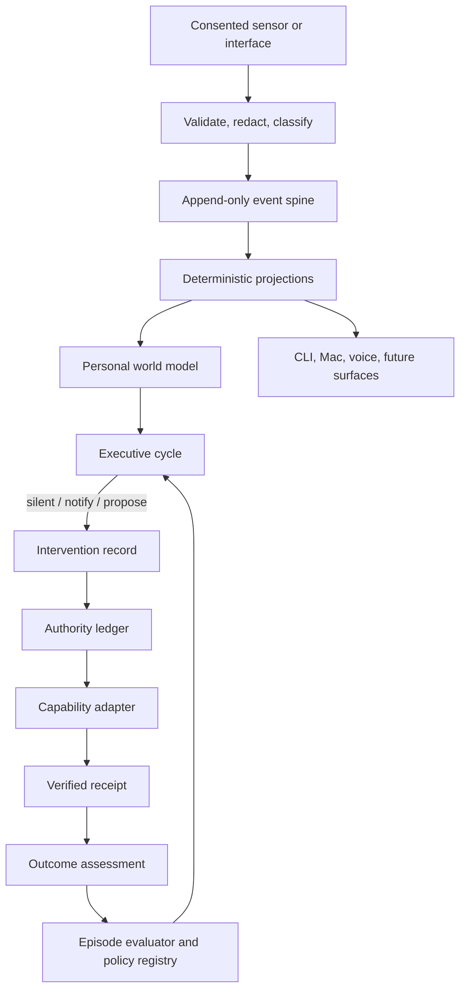
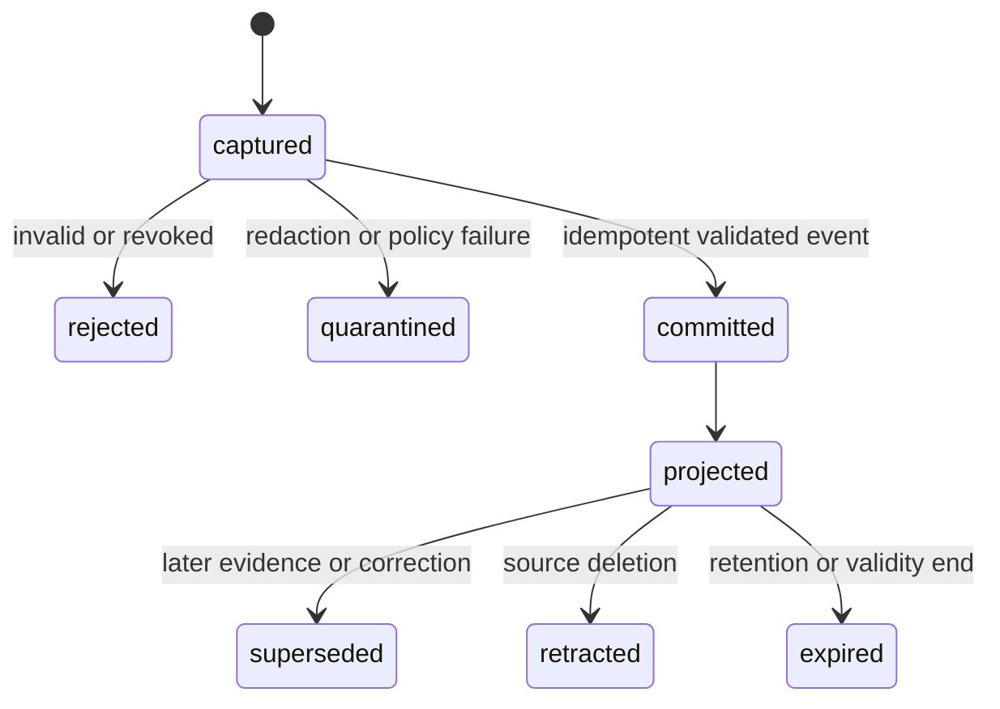
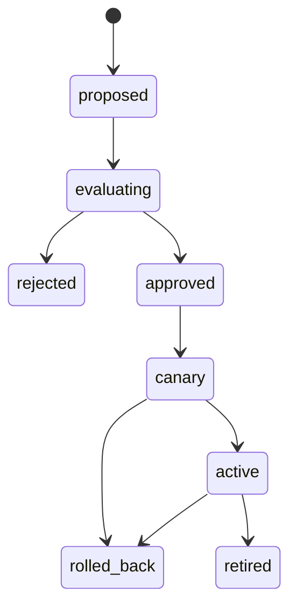

# Personal Intelligence Runtime - Plan

## Goal Capsule

- **Objective:** Make Flyd a local-first personal intelligence that can maintain grounded beliefs about George's world, choose and evaluate helpful interventions, and improve its behaviour from verified outcomes.
- **Means:** Replace disconnected runtime state with a TypeScript Core event runtime, deterministic projections, a governed sensing mode, capability authority, and replay-gated policy promotion. (KTD1–KTD5)
- **Authority:** Flyd may observe and reason only within active source consent. It may act only through a capability grant that permits the exact effect. High-impact and irreversible actions remain human-confirmed.
- **Stop conditions:** Stop rollout when event reconciliation fails, a privacy invariant fails, an authority check can be bypassed, or a candidate policy regresses a protected replay case.
- **Execution profile:** Deep, staged migration. Each new projection runs beside the legacy owner until reconciliation proves parity.

---

## Product Contract

### Summary

This plan makes Flyd's durable unit of intelligence a provenance-bearing event and its derived world model, not a chat turn, a work session, or an archive record.
It introduces a separate opt-in LEARN mode for personal sensing while preserving PRESENT exactly as it is.
It gives Flyd a governed executive loop and a replay-based way to improve policies without unrestricted self-modification.

### Problem Frame

Flyd currently has useful sensors, action safety, memory, repository observation, jobs, and evidence adapters.
They store state and make decisions through separate paths, so Flyd cannot form one durable view of George or prove that it learned from an outcome.
The active work-intelligence authority is intentionally narrower than the personal system requested here.

### Key Decisions

- **Full-life personal intelligence is the product.** (session-settled: user-directed — chosen over a work-only copilot: Flyd must be for George, not only his work.) Governs R1, R2, R4, R7.
- **Chat, voice, and overlay are interfaces.** (session-settled: user-directed — chosen over request-response cognition: they must query and operate the shared runtime.) Governs R3, R10.
- **Self-improvement changes only proven policy.** (session-settled: user-directed — chosen over stored memories or unrestricted source rewriting: helpfulness must improve through evidence.) Governs R8, R9, R12.

### Requirements

**Canonical intelligence state**

- R1. Store all new personal-runtime facts as immutable, versioned events with source, consent, retention, provenance, idempotency, correlation, and causation metadata.
- R2. Derive entities, beliefs, intentions, commitments, opportunities, interventions, outcomes, and policy state from events; no projection becomes an independent authority.
- R3. Require every ingress and egress to use one `ContextEnvelope` and produce a durable receipt or decision record.
- R4. Separate observed facts, inferred beliefs, user-confirmed intentions, proposed actions, and verified outcomes in types, storage, prompts, and UI.

**Consent, privacy, and agency**

- R5. Preserve all existing PRESENT privacy invariants without semantic changes.
- R6. Add LEARN as an off-by-default, source-specific sensing mode with inspect, pause, exclude, revoke, export, erase, retention, and model-egress controls.
- R7. Redact and classify data before event persistence or model access; raw payload retention is optional, local by default, and independently erasable.
- R8. Require an expiring, scope-bound capability grant and a verifier contract for every side effect; observations and read-only investigation do not imply action authority.

**Executive and self-improvement behaviour**

- R9. Run a durable executive cycle that forms ranked opportunities, records why it chose silence, notification, proposal, or permitted action, and enforces attention and cost budgets.
- R10. Attach each intervention to its belief/evidence, prediction, alternatives, authority, policy version, execution receipt, and outcome assessment.
- R11. Treat acceptance or rejection as evidence, not proof of success; record direct verification, later observed impact, and unknown outcomes distinctly.
- R12. Promote a policy candidate only after replay against frozen, consented episodes shows its declared improvement and no protected privacy, safety, truthfulness, interruption, or cost regression.
- R13. Make promotions, canaries, rollbacks, expiry, and policy versions inspectable and reversible.
- R14. Give every surface a common review contract for belief correction and intervention outcome: helpful, not helpful, unknown, optional reason, and visible provenance.

### Actors

- A1. **George:** grants source and action authority, inspects and corrects beliefs, and can pause, revoke, export, or erase data.
- A2. **Swift adapter:** captures consented local signals, renders state, and executes grounded Mac actions without choosing policy.
- A3. **TypeScript Core:** owns event ingestion, projections, executive decisions, authority checks, evaluation, and state streams.
- A4. **Capability adapters:** read evidence or perform a bounded effect and return a verified receipt.

### Key Flows

- F1. **Consent-to-belief:** George enables one LEARN source; the adapter validates the source contract, emits a redacted event, and the Core derives an inspectable belief with evidence and expiry.
- F2. **Helpful intervention:** the executive ranks an opportunity, records a prediction and policy version, chooses a low-interruption delivery, and links later verification or correction to the same causal chain.
- F3. **Policy promotion:** a candidate policy runs against frozen episodes, passes safety and regression gates, canaries under its budget, then becomes active or rolls back through events.
- F4. **Erasure:** source revocation stops capture immediately; source deletion tombstones raw material and recomputes projections, indexes, replay eligibility, and active context.

### Acceptance Examples

- AE1. Given PRESENT is active and LEARN is disabled, foreground changes do not create a personal event or persist general environment data. Covers R5, R6.
- AE2. Given an enabled low-sensitivity source reports a duplicate event after restart, one canonical event and one projection result exist. Covers R1, R2.
- AE3. Given Flyd proposes a message but the target or grant changes before execution, the capability refuses to act and records a stale receipt. Covers R8, R10.
- AE4. Given a candidate policy improves its target metric but increases interruption failures on protected episodes, promotion is rejected. Covers R12, R13.
- AE5. Given George deletes a source, later retrieval and executive context contain neither its raw data nor derived active beliefs. Covers R6, R7.
- AE6. Given an egress grant is absent, revoked, or does not permit a field, no model or evidence provider receives that field and a redacted denial receipt is recorded. Covers R6, R7.
- AE7. Given George corrects a belief or explicitly judges an intervention, the correction supersedes the inference and the outcome is eligible for a consented episode; no response stays unknown. Covers R4, R11, R14.

### Success Criteria

- The same personal situation produces one evidence-linked state across CLI, INVOKED, LIVE, jobs, and future desktop surfaces.
- Flyd can show a complete causal chain for every proactive intervention.
- A policy can demonstrate a measured replay improvement, canary safely, and roll back without source edits.
- A seven-day dogfood run produces one consented, useful non-work calendar-metadata intervention and one inspectable policy adaptation without violating PRESENT or source consent.

### Scope Boundaries

**Deferred to Follow-Up Work**

- High-sensitivity sensors such as raw screen text, clipboard, microphone, communications content, location, health, finance, and relationship data.
- Autonomous sending, purchasing, publishing, account changes, legal/medical advice, or destructive deletion.
- Broad third-party connector catalogue and remote/cloud synchronization.
- Autonomous source-code rewriting by Flyd.

**Outside this product's identity**

- A second Rails runtime or Rails-backed intelligence path.
- A generic chat shell that bypasses the runtime.
- Quietly widening PRESENT collection or retention.

---

## Planning Contract

### Key Technical Decisions

- KTD1. **Use a local TypeScript Core event runtime backed by SQLite WAL.** (session-settled: user-directed — chosen over work/chat/Rails split: all interfaces need one persistent mind.) Create an append-only `intelligence.sqlite` with idempotent event writes and replayable projections. Keep native systems and raw artifacts canonical at their source.
- KTD2. **Model epistemic state as typed projections.** Observations, beliefs, intentions, opportunities, interventions, outcomes, and policies have separate schemas and legal transitions. Freshness, confidence, relevance, and usefulness remain independent dimensions.
- KTD3. **Keep PRESENT isolated and introduce LEARN as a new consent plane.** (session-settled: user-directed — chosen over weakening PRESENT: ambient learning needs distinct, revocable consent.) OS permission does not substitute for source, purpose, retention, and egress consent.
- KTD4. **Generalize verified action grants into an authority ledger and make model/network egress a separate fail-closed gateway.** (session-settled: user-directed — chosen over broad standing autonomy: self-improvement must not bypass safety.) Every capability receives minimum context, an effect-specific grant, target fingerprints, expiry, idempotency, and a verifier. Model or evidence calls additionally require source-, purpose-, field-, and destination-specific egress consent; an action grant never implies egress authority.
- KTD5. **Treat self-improvement as policy promotion.** (session-settled: user-directed — chosen over unrestricted source rewriting: changes require measurable helpfulness.) Candidates may initially change prompts, retrieval, scheduling, ranking, and tool routing. They use time-split holdouts, shadow/canary rollout, protected regression cases, and rollback.
- KTD6. **Migrate through adapters and reconciliation.** Legacy owners dual-write canonical events and retain reads until hashes, counts, causal links, and deletion behavior reconcile. No bulk destructive conversion.

### High-Level Technical Design

The diagrams are directional. They define boundaries and data ownership, not APIs or file layouts.

### System-Wide Impact

- The Core becomes the only policy and state authority. Swift remains a sensor, renderer, and executor.
- Existing `~/.flyd` archives remain evidence storage. They no longer own derived truth or policy.
- Existing work-index, journal, jobs, task, and session stores become adapters or projections during migration.
- The event schema must support source erasure and replay exclusion without erasing the minimal audit tombstone needed to prove deletion.
- The runtime must expose typed local state subscriptions so no surface recreates a smaller intelligence.

### Risks and Dependencies

- **Privacy risk:** new sensing can silently over-collect. Mitigate with LEARN-only contracts, pre-persistence redaction, per-source invariants, and immediate revoke tests.
- **Migration risk:** dual state can drift. Mitigate with idempotency keys, replay, parity reports, and reader cutover one owner at a time.
- **Learning risk:** reward hacking or noisy feedback can reinforce bad behaviour. Mitigate with delayed/unknown outcomes, protected cohorts, metric separation, human-readable promotion receipts, and automatic rollback.
- **Operational risk:** an executive loop can flood or stall. Mitigate with leases, sequence checkpoints, retries, cooldowns, quiet hours, attention budgets, and kill switches.
- **Dependency:** current `cli/src/work/database.ts` SQLite conventions and existing action-verification tests remain the local persistence and authority baseline.

### Sequencing

Build authority and contracts first. Then establish event/projection correctness before migrating writers. Add LEARN and executive behaviour only after the runtime can preserve consent, causality, deletion, and fail-closed authority. Add policy promotion only after episodes and outcomes are trustworthy.

---

## Implementation Units

### U1. Establish personal-intelligence product and privacy authority

- **Goal:** Replace work-only product authority with a personal-intelligence contract that implementation can test.
- **Requirements:** R1, R4–R9, R12, R13.
- **Files:** `docs/product/flyd-personal-intelligence-prd.md`, `docs/product/flyd-work-intelligence-prd.md`, `mac-adapter/Sources/Privacy/PrivacyInvariants.swift`.
- **Approach:** Define event/state taxonomy, LEARN consent obligations, action authority, promotion governance, retention/deletion semantics, and an explicit supersession map for the current work PRD. Preserve PRESENT invariants verbatim and add falsifiable LEARN invariants without enabling a source.
- **Test Scenarios:** Verify the authority document excludes Rails runtime ownership, raw sensitive sensing by default, and autonomous high-impact effects. Verify existing privacy-invariant tests still describe PRESENT unchanged.
- **Verification:** Review the supersession map against `AGENTS.md`; run Swift privacy tests after the invariant additions.
- **Dependencies:** None.

### U2. Build the canonical event spine and projection framework

- **Goal:** Add the sole durable write path for personal-runtime state.
- **Requirements:** R1–R4, R6, R7.
- **Files:** `cli/src/intelligence/`, `cli/src/intelligence/context-envelope.ts`, `cli/src/work/database.ts`, `cli/src/lib/config.ts`, `cli/src/intelligence/__tests__/event-store.test.ts`, `cli/src/intelligence/__tests__/context-envelope.test.ts`, `cli/src/intelligence/__tests__/projection-replay.test.ts`.
- **Approach:** Define and version the shared `ContextEnvelope` at the durable boundary before adding a local SQLite WAL database with schema-versioned immutable events, source/consent/retention metadata, encrypted-or-referenced raw payload handling, tombstones, idempotency, and deterministic projector checkpoints. Use a per-source encrypted payload/reference domain: source deletion destroys the domain key or reference, leaves only a non-identifying deletion audit tombstone, and queues sweeps for projections, indexes, WAL/backup handling, replay snapshots, and legacy copies. The validator binds correlation, consent snapshot, minimum evidence references, applicable policy, authority/budget, and required receipt-or-decision semantics for every sensor, interface, executive, and capability path. Expose typed append/read/replay APIs; projectors may rebuild from any sequence position.
- **Test Scenarios:** Duplicate and reordered events produce identical projections. Invalid, redaction-failed, revoked, and expired events never reach projections. Source deletion retracts dependent projections, destroys every readable payload/reference domain, sweeps indexes/replay/legacy copies, and prevents replay inclusion. Restart resumes from a checkpoint without duplicate execution. Sensor, executive, Chat/INVOKED/LIVE, and capability-fixture envelopes validate under one contract and every egress produces a receipt or recorded decision.
- **Verification:** Run focused TypeScript tests and a replay/property suite. Produce an event/projection hash report for fixture data.
- **Dependencies:** U1.

### U3. Add personal world-model projections and migrate current-work belief

- **Goal:** Give Core one typed, inspectable model of entities, beliefs, goals, commitments, and outcomes.
- **Requirements:** R2–R4, R10, R11, R14.
- **Files:** `cli/src/intelligence/world/`, `cli/src/work/work-hypothesis/`, `cli/src/work-intelligence/current-work.ts`, `cli/src/runtime/conversation-memory.ts`, `cli/src/intelligence/__tests__/world-model.test.ts`.
- **Approach:** Define entity identity resolution and claim/belief lifecycle projections. Keep observation, inference, correction, user confirmation, conflict, validity time, and source evidence separate. Reimplement Present Model and Current Work as world-model projections; retain legacy readers during parity comparison.
- **Test Scenarios:** A user correction supersedes an inference without destroying its evidence. Conflicting current and durable claims remain visible with authority labels. Old evidence changes freshness but not epistemic confidence. A work-only event projects into Current Work without becoming personal intent.
- **Verification:** Run existing work-hypothesis/current-work suites plus new world-model cases. Compare legacy and projected Present Model output on a frozen repository fixture set.
- **Dependencies:** U2.

### U4. Generalize capability authority and verified receipts

- **Goal:** Make every effect flow through one minimum-context authority ledger.
- **Requirements:** R3, R8, R10, R11.
- **Files:** `cli/src/intelligence/capabilities/`, `cli/src/intelligence/egress-policy-gateway.ts`, `cli/src/work-intelligence/types.ts`, `cli/src/work-intelligence/command-execution.ts`, `cli/src/runtime/result-verifier.ts`, `cli/src/server.ts`, `cli/src/intelligence/__tests__/authority-ledger.test.ts`, `cli/src/intelligence/__tests__/egress-policy.test.ts`.
- **Approach:** Introduce capability manifests that consume U2's shared `ContextEnvelope`, effect-specific grants, target fingerprints, consequence classes, expiry, cancellation, retry, rollback posture, and verifier receipts. Route every provider/model/evidence call through an `EgressPolicyGateway` that validates source, purpose, data classification, destination, payload schema/size, and current egress consent, then emits a redacted allow/deny receipt. Treat every provider/model response as `UntrustedResult`: it may become typed evidence or a proposal only after schema/provenance validation and Core-owned reasoning; it can never mint authority, change a target, invoke a capability, or render a user-facing command directly. Adapt repository, command, Mac-native, and evidence adapters behind separate registries; do not widen the evidence registry into an action-policy owner.
- **Test Scenarios:** Forged, replayed, expired, revoked, over-broad, and stale-fingerprint grants fail before execution. A partial receipt never becomes verified success. Capability adapters receive only declared context. A raw or non-egress-authorized field never reaches mocked model/evidence providers, including retry and queued-work paths. Malicious provider output cannot widen egress, mint a grant, change a target, or auto-execute. Cancellation leaves an inspectable terminal receipt.
- **Verification:** Run existing result-verifier, repository action, command-execution, and Swift target-fingerprint tests with parity fixtures.
- **Dependencies:** U2, U3.

### U5. Introduce LEARN mode and source-governance controls

- **Goal:** Enable safe personal sensing without changing PRESENT.
- **Requirements:** R5–R7.
- **Files:** `mac-adapter/Sources/State.swift`, `mac-adapter/Sources/Config/OverlayConfig.swift`, `mac-adapter/Sources/Observation/`, `mac-adapter/Sources/UI/PrivacySettingsView.swift`, `cli/src/intelligence/sensors/`, `mac-adapter/Tests/`, `cli/src/intelligence/__tests__/sensor-consent.test.ts`.
- **Approach:** Add LEARN lifecycle states and reusable source contracts. Prove them with exactly one initial low-sensitivity, non-work source: calendar metadata. Onboard repository activity, selected files, and app transitions only after this source passes its consent/erasure gates; they are additional source contracts, not part of U5's launch proof. Classify the existing PRESENT foreground-feedback pipeline as a bounded complaint transport outside the personal event spine: preserve its current narrow privacy contract and separate retention owner; it must never become a LEARN source or canonical personal event unless George later enables a dedicated source contract. Enforce exclusion, incognito, pause, revoke, retention, local-only transport, redaction, inspect/export/delete, and source health before LEARN event creation.
- **Test Scenarios:** Calendar metadata cannot emit an event before its source contract is enabled. PRESENT emits no general personal events while bounded legacy foreground feedback retains its separate complaint contract. Revocation immediately stops LEARN capture and queued analysis. Incognito/excluded apps create no event. Raw screen, clipboard, audio, and communication content remain unavailable by default. A source deletion makes raw payload unrecoverable from canonical, projected, indexed, replay, and legacy-derived storage.
- **Verification:** Run all PRESENT invariant and adapter tests unchanged, then LEARN consent/falsification tests on an installed app as well as Core fixtures.
- **Dependencies:** U1, U2, U4.

### U6. Build the durable executive cycle and intervention queue

- **Goal:** Replace isolated brief/job behaviour with an explainable, budgeted decision loop.
- **Requirements:** R3, R9–R11.
- **Files:** `cli/src/intelligence/executive/`, `cli/src/runtime/brief-scheduler.ts`, `cli/src/work-intelligence/jobs/`, `cli/src/runtime/daily-brief.ts`, `cli/src/intelligence/__tests__/executive-cycle.test.ts`.
- **Approach:** Consume projected event sequence positions under a lease. Create opportunities, rank expected benefit/urgency/confidence/interruption cost, investigate read-only evidence when allowed, and persist a decision to remain silent, bundle, notify, propose, or act. Make the daily brief and existing job runner delivery mechanisms rather than intelligence owners.
- **Test Scenarios:** The same opportunity/policy/world-state digest does not interrupt twice. Quiet hours, cooldowns, daily interruption budget, pause, and kill controls suppress delivery. Crash/retry resumes without a duplicate proposal. Every decision includes a concise why-now/why-me trace.
- **Verification:** Run job scheduling/pause/idempotency tests and executive lease/deduplication fixtures. Dogfood with notifications disabled and inspect decisions before enabling delivery.
- **Dependencies:** U2–U5.

### U7. Build outcome assessment, episodes, and policy promotion

- **Goal:** Let Flyd adapt only when a bounded change proves more helpful.
- **Requirements:** R10–R13.
- **Files:** `cli/src/intelligence/outcomes/`, `cli/src/intelligence/evaluation/`, `cli/src/intelligence/policies/`, `cli/src/lib/skill-optimizer.ts`, `cli/src/lib/curiosity.ts`, `cli/src/intelligence/__tests__/episode-replay.test.ts`, `cli/src/intelligence/__tests__/policy-promotion.test.ts`.
- **Approach:** Materialize consented episodes from causal chains. First prove the learning contract using existing INVOKED and explicit correction/outcome flows: evaluate one low-risk recommendation/ranking policy in shadow replay, then run a bounded approved canary without waiting for LEARN or proactive delivery. Add outcome windows and attribution states. Convert curiosity, skillify, and optimiser results into policy candidates only. Freeze cohort eligibility, outcome maturity, target metric, practical-effect threshold, protected non-inferiority bounds, and minimum evidence threshold before candidate generation; insufficient, unknown, or attribution-incomplete outcome data cannot promote a policy. Evaluate incumbent versus candidate on time-split replay cohorts, enforce protected regressions and cost/privacy budgets, then record rejection, canary, activation, expiry, or rollback as events. U6 later supplies executive-policy candidates and delivery outcomes through the same contract.
- **Test Scenarios:** A positive user reaction with no outcome remains inconclusive. A one-event apparent gain, missing delayed outcome, post-hoc cohort selection, or post-hoc metric selection rejects promotion as insufficient evidence. A candidate cannot influence its training/holdout split. Target improvement cannot override a safety or interruption regression. The early INVOKED-only candidate runs shadow replay and a bounded approved canary without LEARN enabled. Canary rollback restores prior policy and preserves the decision receipt.
- **Verification:** Run deterministic replay with mocked capabilities and evidence snapshots. Require a before/after report, protected-cohort pass, and rollback drill before a live policy activates. Demonstrate the early learning proof before enabling proactive delivery.
- **Dependencies:** U2–U4.

### U8. Migrate all interfaces and legacy writers through runtime adapters

- **Goal:** Remove private intelligence paths without losing current behaviour or provenance.
- **Requirements:** R1–R14.
- **Files:** `cli/src/server.ts`, `cli/src/resolve.ts`, `cli/src/work-intelligence/work-interaction-service.ts`, `cli/src/runtime/archive-outbox.ts`, `cli/src/work-intelligence/outcome-journal.ts`, `cli/src/runtime/memory-ingest.ts`, `cli/src/runtime/conversation-responder.ts`, `mac-adapter/Sources/Bridge/`, `cli/src/intelligence/migration/`.
- **Approach:** Route chat, INVOKED text/voice, LIVE, memory ingest, LEARN feedback, jobs, closeouts, task receipts, and evidence results through adapters that attach one `ContextEnvelope`. Expose the same review record on CLI and Mac surfaces: belief correction, helpful/not-helpful/unknown outcome, optional reason, evidence/provenance, and causal link to the intervention. Keep the existing PRESENT foreground-feedback complaint transport outside this migration and its canonical event eligibility; preserve its narrow retention owner until a separately governed product decision changes it. Dual-write legacy events with preserved IDs, paths, timestamps, and `legacy_import` provenance. Cut each reader to projections only after reconciliation, then retire the private write path.
- **Test Scenarios:** Equivalent chat, INVOKED, LIVE, and job inputs produce the same consent/authority policy. A belief correction supersedes inference and an explicit outcome enters an eligible episode while a missing response remains unknown. PRESENT foreground feedback cannot produce a personal event while LEARN is disabled. Old `/manifest` behaviour remains available during migration. Unmatched legacy outcomes are recorded as causally incomplete, not learned success. Backfill is idempotent and source deletion affects legacy-derived projections without resurrection from a queued legacy event.
- **Verification:** Run cross-surface golden fixtures, migration count/hash/causal-link reports, full CLI tests, Core build, and installed-adapter smoke tests. Remove a legacy writer only after its dual-write and read-parity gates pass.
- **Dependencies:** U2–U7.

---

## Verification Contract

| Gate | Applies to | Proof |
|---|---|---|
| Event correctness | U2–U8 | `npm test` focused suites for idempotency, replay, migrations, projection parity, and erasure |
| Epistemic integrity | U3, U6, U7 | Fixtures prove observation, belief, intent, action, and outcome stay distinct; conflicts and uncertainty survive retrieval |
| PRESENT preservation | U1, U5, U8 | Existing Swift privacy invariants pass unchanged; PRESENT emits no new event type |
| LEARN consent | U5–U8 | Source-specific pause/revoke/exclusion/incognito/redaction/retention/local-egress falsifiers pass |
| Authority safety | U4, U6, U8 | Forged/stale/revoked/replayed grants and changed targets fail closed; receipts are independently verified |
| Executive reliability | U6 | Lease, crash recovery, deduplication, cooldown, quiet-hours, interruption-budget, and kill-switch tests pass |
| Promotion safety | U7 | Frozen episode replay shows target gain, no protected regressions, bounded cost, canary record, and rollback drill |
| Cross-surface parity | U8 | Golden fixtures show Chat, INVOKED, LIVE, and job adapters preserve consent, context, authority, provenance, and outcome links |
| Full regression | U8 | `cd cli && npm test`, `cd cli && npm run lint`, `cd cli && npm run build`, and `make -C mac-adapter install` smoke proof |

---

## Definition of Done

- Canonical event records and replayable projections are the only durable personal-intelligence write path for migrated routes.
- PRESENT keeps every current privacy invariant. LEARN has independent, passing consent and erasure invariants.
- Every proactive intervention can display its evidence, prediction, policy version, authority, receipt, and outcome status.
- No action capability can execute with absent, stale, revoked, mismatched, or over-broad authority.
- At least one policy candidate has completed replay, canary, and rollback exercises using consented historical episodes.
- Legacy stores have no remaining authoritative writer after their reconciliation gate passes; raw evidence/provenance remains preserved.
- The TypeScript Core and installed Mac adapter both pass their relevant checks. No Rails component becomes an active runtime dependency.
- The final diff contains no abandoned prototype paths or duplicate policy/state owners.

---

## Appendix

### Sources and Research

- `docs/product/flyd-work-intelligence-prd.md` — current authority being superseded for this broader product direction.
- `docs/product/flyd-personal-agent-platform-prd.md` — reusable one-runtime and shared-state principles; its Rails topology is obsolete.
- `docs/plans/2026-07-28-003-feat-unified-memory-architecture-plan.md` — canonical event/claim runtime was explicitly deferred; preserve epistemic dimension separation.
- `docs/plans/2026-08-09-001-fix-trustworthy-repository-outcomes-plan.md` — grant, verifier, and receipt pattern to generalize.
- `docs/solutions/architecture-patterns/skill-capability-layer-for-specialists-2026-08-19.md` — capability contracts, regression cases, and learning promotion pattern.
- `cli/src/work/database.ts` — local SQLite WAL/foreign-key/test-injection persistence baseline.
- `cli/src/evidence/capability-registry.ts` — health-aware adapter selection pattern; keep evidence and action registries separate.
- `mac-adapter/Sources/Privacy/PrivacyInvariants.swift` — PRESENT invariants that LEARN must not weaken.
- [Apple App Sandbox guidance](https://developer.apple.com/documentation/security/app-sandbox) — least privilege and platform resource boundaries.
- [Apple machine-learning guidance](https://developer.apple.com/design/human-interface-guidelines/machine-learning) — proactive features require strict privacy, calibration, and feedback control.
