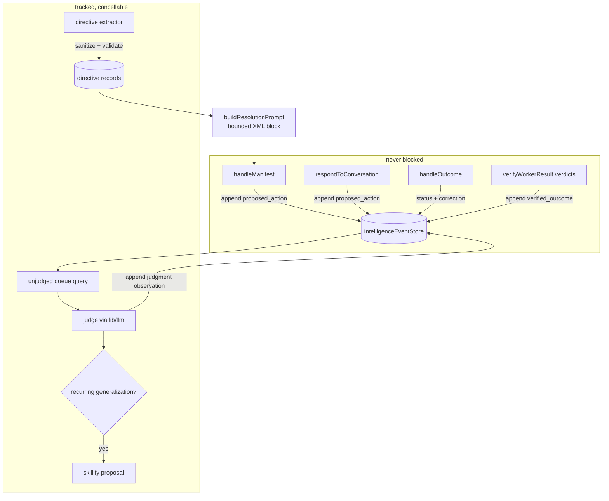

# feat: Consequence-learning transition log and directive layer

## Summary

Give Flyd consequence supervision: every interaction becomes an append-only transition record (action → next-state → outcome), an async background judge scores ambiguous outcomes, and user corrections become sanitized behavioural directives injected into future resolution prompts. Built as the first production writer on the existing `IntelligenceEventStore` spine; explicitly excludes RL, weight updates, credit-assignment machinery, and GUI/scene signal capture.

---

## Problem Frame

Flyd's current learning loop ends at capture → detect pattern → create skill (memory gate → receipts → skillify proposals). Recurrence says nothing about whether behaviour was *good*: a pattern occurring three times can become a skill regardless of outcome. The OpenClaw-RL paper (arXiv 2603.10165) supplies the missing primitive — the next-state signal that immediately follows every action is free supervision, and its *directive* component (how the action should have been different) outperformed scalar rewards alone in their experiments (0.72 vs 0.23 personalization). Frontier-model weights can't be updated, so we steal the architecture, not the RL: log transitions everywhere, learn from corrections first, score everything so richer policy work stays possible later.

---

## Requirements

- R1. Every INVOKED overlay invocation and CLI chat turn produces a durable transition record binding action and next-state, correlated end-to-end.
- R2. Deterministic next-state signals (resolution outcome status, correction text, worker verification verdicts, command/test failures) are captured without any LLM call.
- R3. An async background judge assigns evaluative scores (+1/0/-1) plus short rationale to transitions whose outcome is ambiguous, without ever blocking a live request; when no model key is configured the pipeline still records and simply leaves rows unjudged.
- R4. Explicit user corrections become concise, schema-validated, sanitized behavioural directives that are automatically available to future resolutions, each carrying provenance back to its source transition.
- R5. Directive injection into resolution prompts is bounded (count + length caps), wrapped in structural prompt boundaries, and never includes raw tool/web/model output — v1 directives derive only from the user's own words.
- R6. Directives have provenance, dimensional scoring (verdict, corroboration, freshness kept separate), and automatic suppression when post-injection outcomes repeatedly go negative.
- R7. Judge-synthesized behavioural generalizations enter the existing skillify propose → human-confirm flow; nothing synthesized by the judge auto-injects into prompts.
- R8. All transition capture sits behind registered source contracts on the intelligence spine: revocable, deletable (source deletion sweeps transitions, judgments, and directives), and visible via governance summary. PRESENT adapter behavior is unchanged — zero new adapter persistence or network.
- R9. No new unauthenticated HTTP surface; capture happens inside existing Bearer-authenticated handlers.
- R10. Existing `/manifest`, `/manifest/outcome`, skillify, memory-gate, and CLI chat behaviour is preserved byte-for-byte when the feature flag is off.

## Scope Boundaries

- No RL training, fine-tuning, or weight updates of any kind.
- No cross-transition credit assignment beyond per-directive utility counters.
- No LIVE voice-session capture (deferred until overlay+CLI prove out).
- No GUI/scene interaction signals (no scene renderer exists yet).
- No grading of stable writing tasks or personal recall — coding/tool/invocation flows only.
- Rails remains untouched; everything lives in TypeScript Core.

### Deferred to Follow-Up Work

- LIVE voice transition capture: once overlay+CLI capture is stable, add a LIVE source contract through the same envelope path.
- Scene/GUI outcome signals: blocked on the scene renderer existing.
- Trajectory evals over multi-step coding runs: needs the park/resume checkpoint format to carry trajectory quality; follow-up after this plan's substrate exists.

---

## Context & Research

### Relevant Code and Patterns

- `cli/src/intelligence/event-store.ts` — `IntelligenceEventStore`: append-only SQLite WAL store with idempotency keys, tombstones, replay. Fully tested, currently **unwired** — no production caller. This plan makes it live.
- `cli/src/intelligence/context-envelope.ts` — `ContextEnvelope` + `validateEnvelope`: kinds (`proposed_action`, `verified_outcome`, `observation`), consent snapshots, sensitive-field scopes, egress decisions.
- `cli/src/intelligence/sensors/source-contracts.ts` + `sensor-gate.ts` + `governance.ts` — `SourceContractRegistry`, `SensorGate`, `deleteSource`/`exportSourceData`. Consent plumbing already exists.
- `cli/src/server.ts` `handleManifest` (:202) and `handleOutcome` (:576): `resolvedContexts` map already correlates invocationId → resolution context; `handleOutcome` already receives `status` ∈ {succeeded, rejected, failed, cancelled} and `correction` text, currently feeding only memoryGate + skillify.
- `cli/src/runtime/result-verifier.ts` — `verifyWorkerResult()` produces `verified`/`partial`/`failed` verdicts; the deterministic coding-harness signal.
- `cli/src/runtime/conversation-responder.ts` — `respondToConversation()`: CLI chat boundary where session turns are observable.
- `cli/src/lib/llm.ts` + `cli/src/lib/config.ts` `resolveModelConnection()`/`defaultChatModel()` — model access for the judge.
- `cli/src/work-intelligence/skillify/proposal-store.ts` / `propose.ts` — dedupe + TTL proposal machinery with `proposeFromLearningCandidate`.
- Background-loop precedents: `setInterval(...).unref()` in `runtime/brief-scheduler.ts`, `delegation-events.ts`; tracked-handle requirement from the overlay security review.
- `buildResolutionPrompt` (`cli/src/resolve.ts`:251) — already accepts many context blocks; directives join as one more bounded block.

### Institutional Learnings

- `docs/solutions/architecture-patterns/skill-capability-layer-for-specialists-2026-08-19.md` — do NOT build a parallel learning store; route learned candidates through skillify propose/confirm; human-gate mined contracts; judge cheaply (forward-only self-review per event).
- `docs/solutions/architecture-patterns/work-intelligence-execution-loop.md` — XML-tag structural boundaries for injected content; non-colliding placeholders; validate against fixed vocabulary at the type boundary and reject whole entries on unknown fields.
- `docs/solutions/architecture-patterns/decouple-confidence-from-freshness-2026-07-28.md` — never fold verdict, corroboration, and recency into one composite score; keep them separate first-class fields.
- `docs/solutions/architecture-patterns/flyd-work-intelligence-pipeline-2026-08-05.md` — layer alongside `/manifest`, don't restructure; TTL-expired correlation returns null and callers must handle it (never silently recreate).
- `docs/solutions/security-issues/overlay-deep-review-auth-bypass-orphaned-tasks-2026-07-23.md` — background async work must be tracked and cancellable; sanitize LLM/error content before persistence.

### External References

- OpenClaw-RL (arXiv 2603.10165): next-state signals as universal supervision; evaluative vs directive split; PRM judge with ternary scores; asynchronous decoupled serving/judging. Results treated as architectural evidence only (simulated users, LLM-judge circularity noted in their own limitations).

---

## Key Technical Decisions

- **D1. Write transitions onto the existing `IntelligenceEventStore`, not a new store.** The spine is built, tested, and consent-aware; a parallel SQLite table would duplicate truth and contradict the skill-capability learning. Two new source contracts: `transition.overlay` and `transition.cli-chat` (plus `transition.harness` for deterministic runtime verdicts), registered in `SourceContractRegistry` and **enabled by default** per the confirmed consent posture ("record now" under existing memory-consent rules).
- **D2. Actions are `proposed_action` envelopes appended in `handleManifest`/`respondToConversation`; next-states are `verified_outcome` (explicit statuses) or `observation` (ambiguous) envelopes appended in `handleOutcome` and harness verdict paths**, correlated by invocationId/sessionId. An outcome arriving after correlation expiry is recorded as a causally-incomplete transition — never dropped, never recreated.
- **D3. The judge is a periodic sweep, not inline.** One tracked, cancellable interval (`.unref()`) batches unjudged transitions, calls the model through `lib/llm.ts`, and appends judgment events (`observation` kind, source `transition.judge`) referencing the transition's sequence number. Judgment carries three separate fields: `verdict` (+1/0/-1), `confidence`, `rationale` — per the decouple-confidence-from-freshness learning. Model unavailable → sweep exits quietly; rows stay unjudged.
- **D4. Only explicit user correction text yields auto-injected directives in v1.** Corrections are sanitized (length-capped, control-pattern-stripped, validated against a fixed directive shape — unknown fields reject the whole entry), then stored as directive records with source-transition provenance. Tool output, test stderr, web evidence, and judge rationales may inform *scores* but never become injected prompt content — that closes the external-content prompt-injection path into persistent prompts.
- **D5. Directive injection is a bounded block in `buildResolutionPrompt`.** Max ~5 active directives, each ≤200 chars, rendered inside an XML-style `<behavioural_directives>` boundary with non-colliding placeholders, ranked by a composite that preserves underlying dimensions (freshness × utility × corroboration stored separately). Suppression: a directive whose subsequent correlated outcomes accumulate repeated negative verdicts is auto-demoted to inactive (simple counter threshold, not credit assignment).
- **D6. Judge generalizations route to skillify, never straight to prompts.** When the judge sees the same directive-shaped lesson across ≥N distinct transitions, it creates a skillify proposal via `proposeFromLearningCandidate` for human confirmation — matching the existing propose→confirm→written governance.
- **D7. Feature-flagged off-switch:** env-gated (`FLYD_TRANSITIONS_DISABLED`) kill switch checked at capture time; with it set, behaviour is identical to today (R10). Default is on, per confirmed scope.
- **D8. No new HTTP endpoints.** Everything captures inside existing authenticated handlers, eliminating the endpoint-auth attack class flagged in the security review.

## High-Level Technical Design

> *This illustrates the intended approach and is directional guidance for review, not implementation specification. The implementing agent should treat it as context, not code to reproduce.*



Transition record shape (payload on the envelope, directional):

```
{
  sessionId, invocationId,
  actor:    { surface: overlay | cli_chat | harness },
  action:   { intent, routeKind, resolutionMode, model, appSummary },
  nextState:{ origin: user | tool | verifier,
              signal: succeeded | rejected | failed | cancelled |
                      verified | partial | error | ambiguous },
  correction?: string        // raw user words, sanitized at extraction time
}
```

Judgment event: `{ transitionSeq, verdict: -1|0|1, confidence: 0..1, rationale }`.
Directive record: `{ directiveId, text, sourceSeq, createdAt, freshness, utility, corroborations, active }`.

---

## Implementation Units

### U1. Transition source contracts and spine writer

**Goal:** Make the intelligence spine writable from live code: register transition source contracts and add typed append helpers for actions, next-states, and judgments.

**Requirements:** R1, R8, R10.

**Dependencies:** None (spine library already exists).

**Files:**
- Create: `cli/src/transitions/types.ts`
- Create: `cli/src/transitions/writer.ts`
- Modify: `cli/src/intelligence/sensors/source-contracts.ts`
- Test: `cli/src/transitions/__tests__/writer.test.ts`

**Approach:**
- Register `transition.overlay`, `transition.cli-chat`, `transition.harness` (low sensitivity, `local_default` retention, enabled by default) and `transition.judge` (operational) in `SourceContractRegistry`.
- `writer.ts` wraps `IntelligenceEventStore.append` with envelope construction: builds `ContextEnvelope` (pathKind `interface` for user-facing sources, `executive` for judge), validates, and exposes `recordAction()`, `recordNextState()`, `recordJudgment()`.
- Kill switch (`FLYD_TRANSITIONS_DISABLED`) checked first in every writer function; disabled → no-op success.
- Store instance created lazily at the existing default intelligence DB path so all consumers share one database.

**Patterns to follow:** `cli/src/intelligence/__tests__/event-store.test.ts` fixture style; `SensorGate` usage in `sensor-consent.test.ts`.

**Test scenarios:**
- Happy path: recording an action then its next-state yields two valid events sharing correlationId; both retrievable in sequence order.
- Edge case: kill switch set → writers return success no-ops and nothing persists.
- Error path: envelope failing validation (missing consent snapshot, revoked source) is rejected by the store and the writer surfaces the rejection instead of swallowing it.
- Integration: after `SourceContractRegistry.revoke("transition.overlay")`, new action writes fail with `consent_revoked`; previously written rows remain for deletion sweep.
- Happy path: judgment append references an existing transition sequence; referencing a nonexistent sequence is rejected.

**Verification:** Focused vitest suite green; `npm run lint` clean in touched files.

---

### U2. INVOKED capture: manifest actions and outcome next-states

**Goal:** Record action → next-state pairs for every overlay invocation without changing response behaviour.

**Requirements:** R1, R2, R9, R10.

**Dependencies:** U1.

**Files:**
- Modify: `cli/src/server.ts`
- Test: `cli/src/__tests__/transitions-manifest.test.ts`

**Approach:**
- In `handleManifest`, after a successful resolution is staged in `resolvedContexts`, fire-and-forget `recordAction()` with intent, route, resolutionMode, model, and the same redacted `environmentSummary` already used by memory receipts. Failures log and continue — capture must never affect the response.
- In `handleOutcome`, map status deterministically: `succeeded → verified_outcome(+1 candidate)`, `rejected/failed → verified_outcome(−1 candidate)`, `cancelled → observation(0)`; attach `correction` verbatim to the event payload (sanitization happens at extraction, U6). Correlate via existing `resolvedContexts`; if the context has expired, still record the outcome marked causally incomplete.
- Keep the existing memoryGate and skillify calls exactly where they are; capture layers alongside them.

**Patterns to follow:** the layer-don't-restructure precedent from the work-intelligence pipeline doc; `checkAuth`-guarded handlers.

**Test scenarios:**
- Happy path: POST `/manifest` then `/manifest/outcome(succeeded)` with a valid token produces a correlated action+outcome pair; response payloads byte-identical to pre-change golden fixtures.
- Edge case: outcome arriving with unknown/expired invocationId → outcome event persisted with causal-incompleteness marker; no crash, no context recreation.
- Error path: writer throwing (e.g., store locked) → handler logs and still returns the normal response.
- Integration: `/manifest/outcome(rejected)` with correction text → outcome event carries the correction; memory-gate receipt unchanged vs fixture.
- Error path: request without Bearer token → 401, no events written.

**Verification:** New suite green; existing `server.test.ts` passes untouched.

---

### U3. CLI chat capture

**Goal:** Record the same transition shape for CLI chat sessions.

**Requirements:** R1, R2.

**Dependencies:** U1.

**Files:**
- Modify: `cli/src/runtime/conversation-responder.ts`
- Test: `cli/src/runtime/__tests__/transitions-conversation.test.ts`

**Approach:**
- Record one action per user turn (intent + responder mode) and one next-state per assistant reply completion or user follow-up/rephrase signal. Session correlation uses the existing conversation session identity; a turn with no resolvable session gets a fresh session id rather than being dropped.
- Rephrase heuristic stays out of v1 scoring — a follow-up turn is recorded as `ambiguous` and left for the judge.

**Patterns to follow:** `respondToConversation()` structure; U2's fire-and-forget posture.

**Test scenarios:**
- Happy path: two-turn conversation yields two correlated transitions under one session id.
- Edge case: responder error mid-turn → action recorded, next-state recorded as `error`; no exception escapes to the user.
- Integration: kill switch set → conversation flow identical to current behaviour with zero events.

**Verification:** Focused vitest suite green; existing conversation-responder tests pass.

---

### U4. Harness deterministic outcomes

**Goal:** Feed worker verification verdicts and command/test failures into the transition stream as next-states.

**Requirements:** R2.

**Dependencies:** U1.

**Files:**
- Modify: `cli/src/runtime/result-verifier.ts` (or a thin observer wrapping its call sites)
- Test: `cli/src/runtime/__tests__/transitions-harness.test.ts`

**Approach:**
- Where `verifyWorkerResult()` resolves, emit `verified_outcome` events mapped `verified → +1`, `partial → 0`, `failed → −1`, attached to the work-session/invocation correlation already present at the call site.
- Command execution errors in the coding-worker path emit `observation(error)` with the exit-code signal only — never raw stderr in the event payload (stderr informs the judge at read time, not persistence time, keeping stored payloads out of injection territory).

**Patterns to follow:** `intelligence/capabilities/execute.ts` execution-receipt typing.

**Test scenarios:**
- Happy path: verifier returning `failed` produces a −1 next-state correlated to the running task's transition.
- Edge case: verdict arrives with no open transition → causally-incomplete record, no crash.
- Happy path: command failure stores exit-signal only; assert payload contains no raw output text.

**Verification:** Focused vitest suite green; existing `result-verifier.test.ts` passes.

---

### U5. Async outcome judge

**Goal:** Score ambiguous transitions in the background without blocking live requests.

**Requirements:** R3.

**Dependencies:** U1, U2.

**Files:**
- Create: `cli/src/transitions/judge.ts`
- Modify: `cli/src/server.ts` (start/stop the sweep with the server lifecycle)
- Test: `cli/src/transitions/__tests__/judge.test.ts`

**Approach:**
- Periodic sweep (default every few minutes, `.unref()`'d interval like `brief-scheduler.ts`) selects unjudged transitions older than a small grace window, batches them, and asks the model (via `lib/llm.ts`) for a strict ternary verdict + confidence + one-line rationale parsed against a fixed schema — unknown fields reject the batch item, mirroring the whole-entry-rejection rule.
- The sweep handle is stored and cancellable; server shutdown cancels cleanly. Concurrency-capped; a slow model call never overlaps the next tick.
- No model key configured → sweep starts, finds nothing to do, exits quietly each tick (R3 fail-open on recording, fail-closed on judging).
- Judgments append as judge-source events; judged rows are never re-judged (idempotency key includes transition seq + attempt).

**Execution note:** Implement the parser against fixture model outputs test-first before wiring the sweep loop.

**Test scenarios:**
- Happy path: fixture model response parses into verdict/confidence/rationale and appends a judgment event.
- Edge case: malformed model JSON → item skipped, marked attempted, batch continues; no partial judgment persisted.
- Error path: model call throws/timeouts → logged, rows remain eligible next tick; sweep survives.
- Integration: kill switch or missing API key → sweep runs but writes nothing.
- Happy path: restart mid-sweep resumes without double-judging (idempotency).

**Verification:** Focused vitest suite with mocked model client; manual run shows judgments appearing for seeded transitions.

---

### U6. Directive extractor and directive store

**Goal:** Turn explicit corrections into sanitized, provenance-carrying, suppressible behavioural directives.

**Requirements:** R4, R5, R6.

**Dependencies:** U2.

**Files:**
- Create: `cli/src/transitions/directives.ts`
- Create: `cli/src/transitions/directives-store.ts`
- Test: `cli/src/transitions/__tests__/directives.test.ts`

**Approach:**
- Triggered synchronously on outcomes carrying `correction`: extract a concise imperative directive (the correction itself is often already the directive — prefer light normalization over an LLM rewrite in v1), validate against a fixed shape `{ text, scope? }` with whole-entry rejection on unknown fields, cap length (~200 chars), strip control sequences.
- Store as flat JSON records beside other `~/.flyd` state (0600, wx-create like `proposal-store.ts`), each with source transition seq, creation time, freshness, utility counter, corroboration count, and `active` flag.
- Dedupe near-identical directives (existing dedupe-key idea from skillify proposals).
- Suppression: when post-injection outcomes correlated while a directive was active accumulate ≥K negative verdicts (K small, e.g. 3), flip `active=false` with the reason stamped. Utility increments on positive verdicts under the same rule.
- Judge-synthesized generalizations (same lesson across ≥N transitions) do **not** land here — they call `proposeFromLearningCandidate()` (D6/R7); covered in U7.

**Patterns to follow:** `skillify/proposal-store.ts` (directory config injection for tests, TTL-style expiry); sanitization rules from the execution-loop learning.

**Test scenarios:**
- Happy path: correction "always inspect the repo before proposing a fix" yields one active directive linked to its source transition.
- Edge case: empty or >cap-length correction → rejected whole, nothing stored; original outcome event unaffected.
- Error path: malformed store file on disk → treated as empty store with a warning, not a crash.
- Happy path: three negative verdicts while directive active → directive flips inactive with stamped reason; subsequent prompt assembly skips it.
- Integration: duplicate correction within TTL → single record updated (dedupe), not duplicated.

**Verification:** Focused vitest suite green.

---

### U7. Skillify bridge for judge generalizations

**Goal:** Recurring judge-observed lessons become human-confirmable skillify proposals instead of silent prompt changes.

**Requirements:** R7.

**Dependencies:** U5.

**Files:**
- Modify: `cli/src/transitions/judge.ts`
- Test: `cli/src/transitions/__tests__/judge-skillify.test.ts`

**Approach:**
- After appending judgments, group recent negative-verdict transitions sharing a directive-shaped lesson; when count ≥ N across distinct sessions, construct a learning candidate and call `proposeFromLearningCandidate()` with the existing dedupe/TTL machinery.
- Proposal content quotes the underlying user corrections (already-sanitized text), never model rationale alone — the human confirming sees real history.

**Test scenarios:**
- Happy path: three distinct sessions with the same negative lesson → one pending skillify proposal; fourth occurrence dedupes to the existing pending proposal.
- Edge case: all occurrences within one session → below threshold, no proposal.
- Integration: proposal confirm/decline flows behave exactly as existing skillify tests expect.

**Verification:** Focused vitest suite green; existing skillify suites untouched and passing.

---

### U8. Prompt injection of active directives

**Goal:** Surface active directives to resolution as a bounded, structurally-isolated context block.

**Requirements:** R4, R5, R6.

**Dependencies:** U6.

**Files:**
- Modify: `cli/src/resolve.ts` (`buildResolutionPrompt`)
- Modify: `cli/src/server.ts` (fetch active directives during resolution staging)
- Test: `cli/src/__tests__/resolve.test.ts` (extend)

**Approach:**
- Add an optional `behaviouralDirectives` parameter rendering at most 5 active directives (≤200 chars each) inside a `<behavioural_directives>` XML boundary with a fixed framing line; absent/empty → block omitted entirely (prompts stay byte-identical otherwise).
- Ranking composite computed from stored dimensions (freshness × utility × corroboration) at read time; the stored fields themselves are never merged.
- Directive fetch is fire-and-forget with a tiny timeout like memory retrieval — a slow read degrades to no block, never to a slower invocation.

**Test scenarios:**
- Happy path: two active directives render inside the boundary, ordered by rank; prompt contains no raw correction metadata (ids/timestamps stay out).
- Edge case: zero active directives → output identical to current golden prompts.
- Edge case: 8 active directives → only top 5 rendered.
- Error path: directive read throws → prompt builds without the block.
- Integration: a suppressed (inactive) directive never renders even if recently created.

**Verification:** Extended `resolve.test.ts` green; evidence-gating eval fixtures unaffected.

---

### U9. Governance visibility and deletion

**Goal:** Prove R8: inspect, export, and erase the new data through the mechanisms that already exist.

**Requirements:** R8.

**Dependencies:** U1–U6.

**Files:**
- Modify: `cli/src/lib/config.ts` (kill-switch env registration)
- Create: `flyd transitions` inspection subcommand in `cli/src/commands/` (list recent transitions/judgments/directives, `--forget <source>` delegating to `deleteSource`)
- Test: `cli/src/transitions/__tests__/governance.test.ts`

**Approach:**
- Reuse `governanceSummary()` / `exportSourceData()` / `deleteSource()` against the transition source contracts; verify sweeps reach directives store too (deletion of `transition.overlay` removes its directive records).
- Document the kill switch and the subcommand in `AGENTS.md` commands section (one line each).

**Test scenarios:**
- Happy path: `--forget transition.overlay` → transitions, their judgments, and derived directives unrecoverable; audit tombstone present.
- Edge case: export on an empty source → valid empty export.
- Happy path: governance summary lists the four transition sources with counts.

**Verification:** Focused vitest suite green; manual `flyd transitions` smoke check.

---

## Phased Delivery

### Phase 1 — Observe (U1–U4)
Transitions and deterministic outcomes flow to disk. No judgement, no behaviour change anywhere. Safe to ship alone.

### Phase 2 — Understand (U5, U9)
Async judging plus governance/visibility. Still zero effect on answers.

### Phase 3 — Act (U6–U8)
Corrections start steering future resolutions; recurring lessons reach skillify confirmation. This is the phase where a regression would be user-visible, so it lands last, behind the kill switch.

---

## System-Wide Impact

- **Interaction graph:** `handleManifest`/`handleOutcome` gain fire-and-forget observers; `buildResolutionPrompt` gains one optional parameter (callers: server resolution path, evals, tests — all use defaults, so signature growth must stay optional-trailing).
- **Error propagation:** capture failures degrade silently to console warnings; they must never alter HTTP responses, resolution results, or chat replies.
- **State lifecycle risks:** `resolvedContexts` TTL expiry creates causally-incomplete pairs by design; the intelligence SQLite DB gains its first production writer — WAL sizing and checkpoint behaviour should be watched in dogfooding.
- **API surface parity:** no new endpoints; Swift adapter untouched (PRESENT invariants intact — all persistence happens in Core post-invocation, matching existing memory-receipt practice).
- **Integration coverage:** cross-layer scenarios needing more than unit mocks — outcome-after-restart correlation, judge sweep racing concurrent writes, directive suppression reacting to live outcomes.
- **Unchanged invariants:** memory-gate receipts, skillify confirm UX, evidence engine, PRESENT privacy invariants, and `/manifest` response shapes are all untouched; `npm test` baseline (including known unrelated legacy type-error noise) is the regression floor.

## Risks & Dependencies

| Risk | Mitigation |
|------|------------|
| Stored directives become a prompt-injection vector | V1 derives directives only from user's own words; fixed-shape validation rejects unknown fields; XML boundary + length/count caps at injection (D4/D5) |
| Noisy judge reinforces bad behaviour | Ternary verdicts with confidence kept separate; judge never auto-writes prompts — generalizations require human skillify confirmation (R7); suppression counter retires harmful directives (R6) |
| Capture overhead slows invocations | Fire-and-forget writes, tiny timeouts, kill switch; Phase gates mean observation ships before any behaviour change |
| Privacy creep — transitions feel like surveillance | Registered source contracts enabled-but-revocable, `flyd transitions --forget`, governance summary; payloads hold redacted summaries only, never raw screen/audio content |
| Intelligence DB corruption takes down learning + future spine consumers | Store already battle-tested (idempotency, replay tests); writer failures isolated; kill switch provides instant disable |
| Model cost of judging every transition | Grace window + batching + only-unjudged selection; ambiguous-only bias (deterministic signals skip judging); cheap forward-only single-pass review per the skill-capability learning |

## Success Metrics

- After two weeks of dogfooding: ≥90% of INVOKED outcomes have a complete correlated transition; deterministic signals cover every harness run.
- Directive quality: sampled injected directives are rated useful-or-neutral by the founder; auto-suppression fires on genuinely bad directives within days, not weeks.
- Zero user-visible latency regression in overlay invocation p95.
- At least one recurring correction successfully promoted through skillify confirmation.

## Alternative Approaches Considered

- **Parallel SQLite transition table outside the spine:** rejected — duplicates consent/deletion machinery and contradicts the documented no-parallel-learning-store rule.
- **Inline judging during `handleOutcome`:** rejected — adds model latency to a user-visible path; the paper's own architecture (and the security review) demand decoupling.
- **LLM-rewritten generalized directives auto-injected:** rejected for v1 — unreviewed model text in persistent prompts is the highest-risk injection surface; generalizations go through skillify human confirmation instead.

## Documentation Plan

- One-line entries in `AGENTS.md`: `flyd transitions` command, `FLYD_TRANSITIONS_DISABLED` switch.
- Capture the append-only-on-existing-spine decision in `docs/solutions/` after implementation stabilizes (per compound workflow).

## Sources & References

- Related code: `cli/src/intelligence/event-store.ts`, `cli/src/server.ts` (`handleManifest`, `handleOutcome`), `cli/src/resolve.ts` (`buildResolutionPrompt`), `cli/src/runtime/result-verifier.ts`, `cli/src/work-intelligence/skillify/`
- Learnings: `docs/solutions/architecture-patterns/skill-capability-layer-for-specialists-2026-08-19.md`, `docs/solutions/architecture-patterns/work-intelligence-execution-loop.md`, `docs/solutions/architecture-patterns/decouple-confidence-from-freshness-2026-07-28.md`, `docs/solutions/security-issues/overlay-deep-review-auth-bypass-orphaned-tasks-2026-07-23.md`
- Related plan: `docs/plans/2026-08-22-0228-feat-personal-intelligence-runtime-plan.md` (spine this plan activates; its U7 promotion machinery is a downstream consumer)
- External: OpenClaw-RL, arXiv 2603.10165
