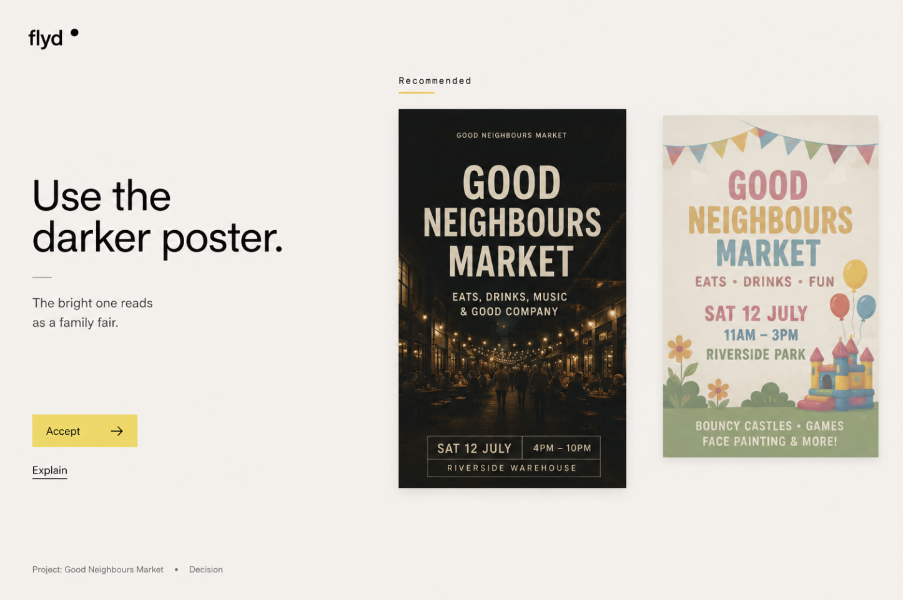

# Flyd Fixed-Stage Interface Design

## Status

Approved visual direction recovered from the supplied Good Neighbours decision screen. This specification replaces the page-like interpretation introduced during the PR #5 cleanup while preserving the intelligence-generated surface architecture.

## Problem

The current renderer turns a composed surface into a vertically flowing document. It uses large headings and editorial spacing, but the result is still a website: content stacks, the page scrolls, and most modes share the same text-first template.

That is not the intended product. Flyd must present one composed application state inside one browser viewport. The interface changes around the work; it does not append another section to a page.

The cleanup also conflated two different ideas:

- generic card or poster-shaped UI is not allowed;
- real posters, images, documents, code, charts, timelines, and other work objects must remain visible when they are the evidence or artifact being judged.

Removing the first must never remove the second.

## Approved Baseline

The Good Neighbours decision screen is the starting point and visual acceptance reference:

- the browser document is locked to one viewport;
- `flyd` is a quiet persistent brand signal at the upper left;
- one semantic scene owns the stage;
- the left region states the recommendation, consequence, and actions;
- the actual dark and bright poster artifacts dominate the remaining space;
- recommendation hierarchy is visible without wrapping either artifact in a generic card;
- project and scene context sit quietly at the lower edge;
- whitespace is structural, not empty page length;
- controls are sparse, direct, and attached to the decision;
- a new situation replaces, recedes, or transforms the current scene instead of extending the document.

This baseline establishes the interaction model and quality bar. It is not a hard-coded Good Neighbours screen and it is not a reusable poster template.

## Product Principles

### The viewport is a stage

The root surface uses `100dvh` and prevents document scrolling. Header, active scene, context line, and universal intent control fit within that stage. A renderer may use bounded internal overflow only when the work object itself requires it, such as a long code diff or conversation transcript. Internal overflow must not turn the application back into a scrolling page.

### The work is the interface

Flyd gives the largest visual area to the evidence, artifact, or executable proposal that requires attention. Text explains or directs the work object; text does not substitute for it when a real object exists.

Examples:

- a design decision shows the actual design alternatives;
- a code action shows the proposed diff or affected files;
- an investigation shows source material, a timeline, a diagram, or structured evidence;
- monitoring shows real measures and change over time;
- a document decision shows the relevant document pages or excerpts;
- a media decision shows the real media.

### Composition follows meaning

Flyd selects semantic content, focus, relationships, and actions. The browser resolves those semantics through a small registry of responsive stage compositions. Renderers present the object assigned to them; they do not choose overall layout.

The stage must support asymmetric compositions. It must not fall back to equal columns, dashboard grids, or one universal text template.

### Quiet means quiet

When no fresh, grounded situation has earned the stage, Flyd presents a minimal quiet state. It must not manufacture investigations, metrics, blockers, recommendations, or placeholder work to make the screen look populated.

## Stage Anatomy

The desktop stage has five persistent semantic regions. Their geometry may change by composition, but their roles remain stable.

1. **Identity**: the Flyd mark at the upper left and a minimal system entry at the upper right.
2. **Direction**: the thesis, recommendation, consequence, or question that explains why this scene owns the screen.
3. **Work field**: the dominant evidence, artifact, proposal, visualisation, or conversation object.
4. **Action field**: the smallest set of controls needed to advance, reject, explain, correct, or inspect the scene.
5. **Context edge**: quiet ownership and scene-type information at the lower edge.

The universal intent control belongs to the stage but does not permanently consume a large horizontal band. In directed modes it remains recessed until focused or invoked, then expands over the stage without causing reflow. In quiet mode it may become the dominant control.

## Composition Registry

### Decision stage

The decision stage follows the approved baseline:

- direction and primary actions occupy a narrow rail;
- two to four real alternatives occupy the work field;
- the recommended alternative receives position and restrained emphasis, not a decorative container;
- choosing an alternative is an executable action;
- explanation and dismissal remain secondary;
- when alternatives have media or artifact references, those objects are shown as the options;
- text-only alternatives are allowed only when no richer grounded object exists.

### Investigation stage

An investigation is not a large question followed by website sections. The unresolved question anchors the direction region while the work field manifests the strongest available evidence in its native form. Known information, uncertainty, and the next investigative action are spatial relationships within the stage, not stacked page content.

The user can bring conversation forward for the exact question. Conversation temporarily takes focus while the investigation remains perceptible as context and returns when conversation recedes.

### Action stage

An action stage shows the proposed change itself: diff, file set, command sequence, schedule, message, or other reviewable payload. Impact and readiness support the proposal. Confirm and reject controls sit with the proposal and preserve the existing approval boundary.

### Monitoring stage

Monitoring uses the work field for actual data, status, and movement. A chart, timeline, progress field, or structured status object is appropriate when supported by evidence. A prose report enlarged to fill the screen is not.

### Conversation stage

Conversation is a renderer within a surface, never the application shell. It may take foreground focus when explicitly entered, but project lists and transcript history do not become primary navigation. Leaving conversation returns to the composed scene.

### Quiet stage

The quiet stage contains the Flyd identity, a concise truthful state, and the universal intent control. It has no fake dashboard content and no generic invitation section extending down the page.

## Responsive Behavior

The document remains locked to one viewport on desktop and mobile.

- Desktop and wide tablet use the full asymmetric stage.
- Narrow tablet reduces supporting detail before reducing the dominant work object.
- Mobile presents one semantic object at a time with explicit next/back or swipe progression where a scene contains multiple objects.
- Mobile alternatives do not become a long vertical page. They become a controlled sequence within the stage.
- The context edge and essential action remain available without covering the work.
- Text uses bounded sizes based on composition and container constraints, never viewport-width font scaling.

## Motion

Motion expresses semantic change:

- `replace` changes the object owning the stage;
- `yield` moves the current object aside while a related object takes focus;
- `recede` keeps context perceptible behind the foreground object;
- `join` introduces supporting evidence;
- `collapse` removes detail without changing the scene;
- `return` restores the prior focus.

Transitions must preserve stable semantic DOM identity, avoid layout jumps, and respect `prefers-reduced-motion`.

## Data And Rendering Contract

The surface plan remains semantic and validated. It never contains CSS, coordinates, HTML, or animation code.

To manifest real work, decision options and other surface items may reference validated evidence through registered object bindings, such as an attachment, artifact, source excerpt, build result, or data series. Every binding must resolve against the exact state snapshot used for composition. Missing or invalid bindings fail validation or fall back to truthful text; they never produce invented media.

Renderer selection and stage composition come from strict registries. Unknown renderers, actions, object bindings, and compositions are rejected.

## Visual Language

- white or near-white stage with black type and restrained gray structure;
- yellow used sparingly for a recommendation or primary decision action;
- square geometry and no decorative rounded containers;
- no gradients, glass effects, floating cards, ornamental diagrams, or equal-weight grids;
- real media is shown cleanly at inspectable size with natural aspect ratio;
- labels are quiet and compact;
- display-scale typography is reserved for the scene thesis, never used as a substitute for absent content;
- icons accompany familiar compact actions where appropriate; unfamiliar icons have tooltips;
- letter spacing is zero except for the small Flyd wordmark if its final brand treatment requires otherwise.

## Accessibility

- DOM order follows the semantic reading and interaction order;
- all actions remain native links, buttons, or forms;
- the stage is fully operable by keyboard;
- focus is visible and moves with semantic foreground changes;
- recommendation is conveyed by label and position, not color alone;
- reduced-motion behavior is complete;
- bounded internal scrollers expose their purpose and do not trap keyboard or touch input;
- mobile scene progression has equivalent non-gesture controls.

## Implementation Boundaries

The rebuild must preserve:

- persisted `Surface` and `SurfaceItem` lifecycle;
- background composition, activation, and broadcast;
- Flyd's semantic judgment boundary;
- exact evidence provenance;
- executable action authorization;
- universal intent interpretation before context persistence;
- durable scene and artifact outcomes.

The rebuild must remove:

- root document scrolling;
- page-section ordering as the primary layout model;
- generic text-only manifestations when grounded work objects exist;
- framed option cards used in place of actual alternatives;
- hard-coded demo content in production surfaces;
- a permanently expanded composer that turns the lower viewport into a website form.

## Acceptance Criteria

1. At desktop and mobile sizes, `document.scrollingElement.scrollHeight` does not exceed the viewport for the root surface.
2. A media-backed decision renders the supplied alternatives as the dominant work objects and matches the approved Good Neighbours composition in hierarchy and density.
3. Decision, investigation, action, monitoring, conversation, and quiet each have a distinct stage manifestation.
4. Directed surfaces do not share a generic large-heading-plus-sections template.
5. Real attachment and artifact references render through validated bindings; fabricated or stale evidence cannot reach the active stage.
6. The universal intent control expands without document reflow and returns focus correctly.
7. Desktop and mobile interactions are verified with browser screenshots and nonblank media checks.
8. Keyboard, reduced-motion, mobile progression, and action execution system tests pass.
9. Existing Rails, system, JavaScript, lint, and security checks remain green.
10. Completed work is committed and pushed on `main`.

## Delivery Sequence

1. Add the fixed-stage shell and responsive stage geometry without changing surface semantics.
2. Add validated work-object bindings and a native object renderer boundary.
3. Rebuild the decision stage against the approved media comparison baseline.
4. Rebuild investigation, action, monitoring, conversation, and quiet as distinct stage compositions.
5. Add recessed universal-intent behavior and semantic foreground transitions.
6. Verify real database states and all viewport modes in the browser, then remove superseded page-layout CSS.
